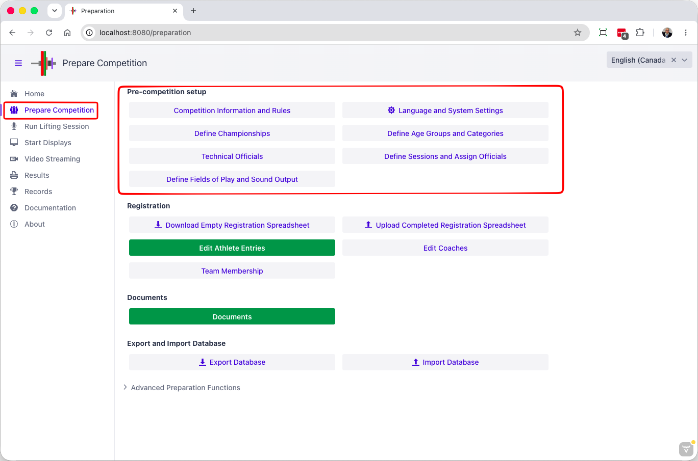

Before entering athletes, it is necessary to define a few items, such as the schedule, the age groups, the platforms, etc.
This is done from the Prepare Competition page.

We will describe this in two stages.
The following pages will deal with the typical setup, and in the advanced topics section we will deal with additional feature that are needed for bigger regional/national/international competitions.