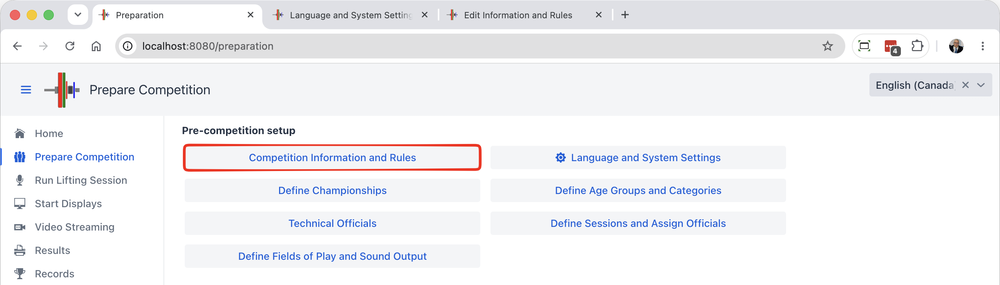
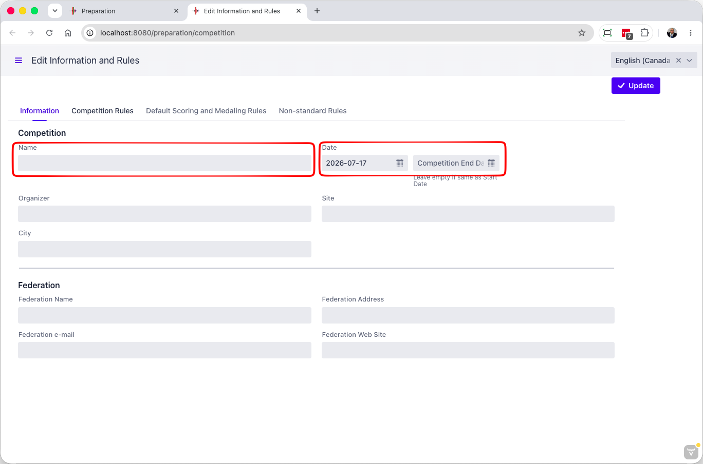
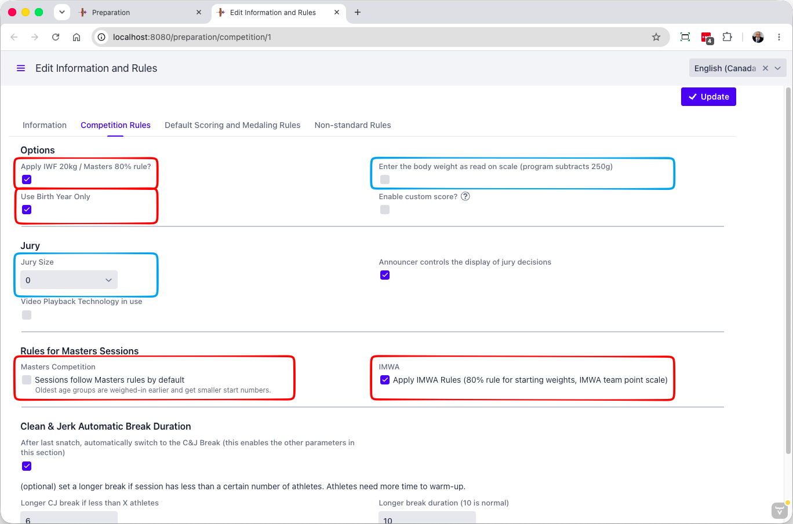
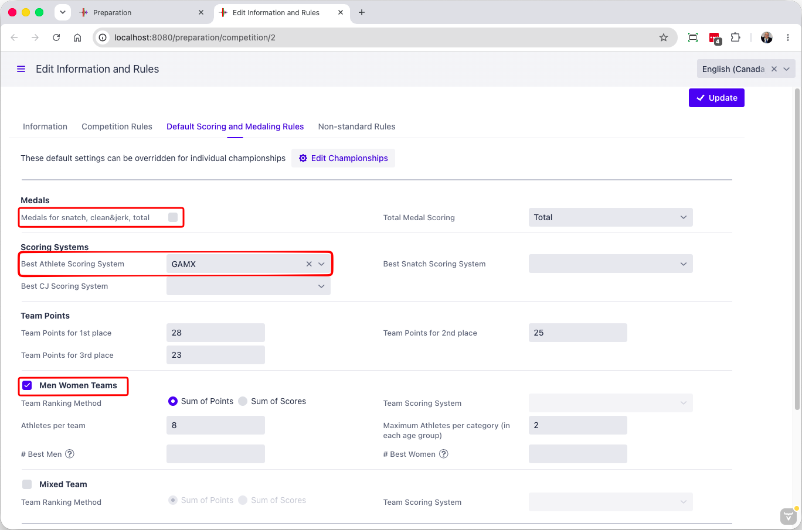

> This page focuses on the typical options. The full set of options is described in the [Competition Rules Reference](2101ReferenceCompetiionInformationAndRules) page.

The `Competition Information and Rules` button leads to a page where general rules and information about the competition are entered.

### Information

The page contains several tabs.  The Information tab is the first one, for general information about the meet.

First, the name and other data about the competition and hosting federation is provided. This information appears on screens and documents.  At the minimum, provide the name and the date(s).

### Competition Rules

These rules are global to the competition.  The typical options to set/check are in the red boxes.

- The `Use Birth Year Only` is typically used for local meets. Many federations use this as it limits the amount of personal information kept and displayed.
- The `Apply IWF 20kg / Masters 80% rule` determines whether the 20kg rule (20% for Masters) will be enforced. Some local or regional meets do not enforce this rule.
- Masters Sessions have some special rules
  - The `Apply IMWA Rules` ensures that the 80% rule is used, and that the team points calculations also follow IMWA rules (categories with 1 or 2 athletes count for less in the team points)
  - If you are running a Masters-only meet, check `Sessions follow Masters Rules by Default`. Otherwise, leave it empty. 
- If there is no Jury, set the Jury size to 0
- The `Enter the body weight as read on scale` is useful to avoid calculations in the weigh-in room.  With that option, if a male athlete weighs 65,25 kg, you enter 65,25 kg.  The system will know that the athlete is allowed 0,25 kg and record him in the 65 kg category.  The only thing the officials have to know is that 65,26 is over the category threshold, they don't need to subtract.

### Default Scoring and Medaling Rules

In OWLCMS, a Championship defines how medals, best athletes and team scores work.  This page defines the "template" that Championships follow by default.  These defaults are used for new Championships you create, or you can go to existing championships using the `Edit Championships` page and reset a championship to use these values.

You will probably want to check the 3 settings in red:

- Are there medals awarded for total only (default) or for the 3 different events
- How to determine the best athlete award (GAMX is the official IWF scoring system since May 2026).  You may still be using Sinclair, QPoints, SMHF, or Robi, for example
- And whether there are team awards

**Non-standard Rules**

Normally you don't need to change those.

