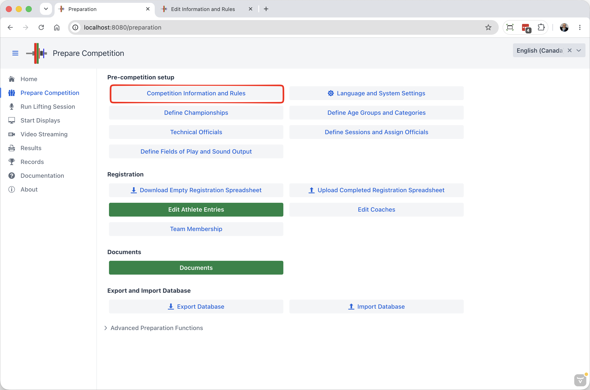

> This page describes the full set of options available, including specialized options for children meets, etc.

Competition Rules are reached from the Prepare Competition page

## Information

The `Competition Information and Rules` button leads to a page where general information about the competition is entered.

First, the name and other data about the competition and hosting federation is provided. This information appears on screens and documents.

- Name: The name of the event that will appear on all documents
- Date:  The start and end dates of the competition 
- Organizer: the organizing club or federation
- Site: the location of the competition
- City: additional detail, to be used for records (typically, City, Country)
- Federation Name: This is the Federation that sanctions the results
- Other fields are optional.

## Competition Rules

The screen also allows selecting common variations on IWF rules.

- Options
  - `Apply IWF 20kg / Masters 20% rule`:  Global flag to determine whether the opening totals rules will be applied.  80% is only selected for sessions where IMWA rule apply (see below)
  - `Enter the body weight as read on scale` (program subtracts 250g): if selected the weight is entered as on the scale (for example 65,15 kg).   The program knows that the athlete is to be entered as 64,90.  The officials only need to check for 65,26 or more being out of category.  The weight as read can be written on the Athlete Card as is to avoid having to subtract; all the documents will use the correct adjusted weight.
  - `Use Birth Year only`: only TCRR requires the full birth date, and the actual day does not even matter. This reduces the personal information identity theft information on documents as well
  - `Enable Custom Score` This adds a box on the Athlete Card where a custom score can be entered manually.  This is sometimes used for kid competitions where bonuses are given for 5/6 or 6/6 performances.  The score can be anything:  a modified total minus penalty points, or Sinclair + bonus, or whatever.

- Jury
  - `Jury Size`: typically 3.  Set to 0 if no Jury.
  - `Announcer controls the display of decisions`: TCRR requires the speaker to announce why a decision was overruled by the jury.  This setting enables the notifications to the speaker. Turning it off makes the attempt board immediately show jury decisions.
  - `Video Playback Technology in use`: When a 5-person jury votes, it is necessary to know whether a majority or unanimous decision is needed.

- Rules for Masters Sessions.
  - `Masters Competition`: if selected, all the sessions will be treated as Masters sessions for introduction order, application of the IMWA rules, and medal ceremony order.  Without this setting, you have to indicate on the Session setup page which sessions are Masters and which are not.
  - `IMWA`: if selected, IMWA rules apply for Masters sessions. 80% rule will be applied, and team points are counted according to IMWA rules (participants in 1- or 2-athlete categories earn fewer team points).

- Clean and Jerk Automatic Break Durations
  - `Automatic switch to CJ Break`:  After the last snatch, automatically enter the Clean & Jerk break (normally 10 minutes)
  - `Longer CJ Break if less than X athletes`.  Normally 6, meaning that 1-5 athletes will get a longer break as set by the Longer Break Duration.  Default is 10 minutes, meaning no change.  When used, the break is typically extended to 15 minutes.
  - `Shorter CJ Break if more than X Athletes`.  Normally 9 meaning that if 10 athletes or more the break will be made shorter.  Default is 10 minutes, meaning no change.  When used, the break is usually shortened to 5 minutes.
  - The `Apply initial total weight rule` determines whether the 20kg rule (20% for Masters) will be enforced.  Some local or regional meets do not enforce this rule.
  - The `Medals for snatch, clean&jerk, total` checkbox determines whether separate rankings will be computed and shown for snatch and clean & jerk.  Leave it unchecked for a "total-only" competition.
  - The `Use Birth Year Only` allows the use of only the 4-digit birth year for athletes, instead of a full date as required by IWF.  Note that the athletes will be registered internally as being born on January 1.
  - `Announcer controls the display of jury decisions` When this setting is checked, the announcer will receive a notification if the jury console screen is used to grant/deny a lift.  When IWF procedures are followed, the announcer will wait and announce the reason, and then click for the competition to resume.  If this setting is not checked, the jury decision is displayed immediately on the attempt board.
  - The `Masters Start Order` settings changes the sorting order for displays and weigh-ins -- Masters traditionally start with the older lifters. The display will be grouped by age group first, and then by weight category.
  - The `Display Categories Ordered by Age Group` setting is like Masters Start Order, but reversed, younger age groups are shown first and weighed-in first.   In a normal IWF scoreboard, Junior and Senior athletes are not separated on the scoreboard (this switch would be off).  This switch is typically used when several youth age groups are competing together in the same session, and younger athletes are unlikely to compete for the older age group medals.

## Default Scoring and Medaling Rules

The page has 3 sections.

- Default Championship Settings: 
  - These settings are explained on the [Championships](2140Championships.md) page.
  - They are used when creating a new Championship, and they are also used if you reset an existing championship to default.  
  - When you install OWLCMS, the settings match the TCRR rules for a Junior or Senior competition with medals awarded for Total.
- `Scoring Systems`
  - The system will look at the settings you have selected for all your championships, and compute all these scores
  - But the user interface also allows for additional scores to be looked at.  For example, you might be curious to look at Sinclair scores even though you currently use GAMX.
  - The checkboxes indicate which additional scores need to be computed.
- `Sinclair`
  - Sinclair coefficients are updated every 4 years.  But many federations still use the 2020 coefficients, and very few have moved to the 2028 ones since QPoints and GAMX have been released.
  - Note that if you use SMHF for your Masters meet, the rule is to use the 2020 Sinclair for SMHF.  Choosing a different Sinclair does NOT change SMHF.

## Non-Standard Rules

These rules affect how start numbers are allocated

- `Round-Robin Order` In team leagues, it is common for all first lifts to be done before the second lift, and so on.
- `Fixed order for lifting` Some league competitions use round-robin play and also decide in advance the lifting order.  This setting means that the lot number assigned to the athlete decides the lifting order within each lift.
- `In Mixed session, group Athletes by Gender`  When hosting kid competitions, it is common to group kids in mixed groups according to age or weight. This setting makes all girls go first to avoid changing bars.
- `Referee Decision Reminder Delay` When using phones/tablets to referee, or MQTT devices that can provide feedback to the referee, this determines the delay (in milliseconds) before sending a reminder.  This does not change the 3 second delay after a decision is given.
- `Display Categories Ordered by Age Group` This is the same idea as Masters that allocates start numbers starting with the older categories.  For kids/youth/junior/senior mixed sessions, this does the same, but in opposite order, younger categories are shown first.
  - IWF TCRR uses the bodyweight categories only as grouping (lighter first).  There is a `bwClassThenAgeGroup` [feature toggle](FeatureToggles.md) that respects bodyweight category groupings but sorts by age group inside the bodyweight.  This feature toggle will be moved to this section in the future.
