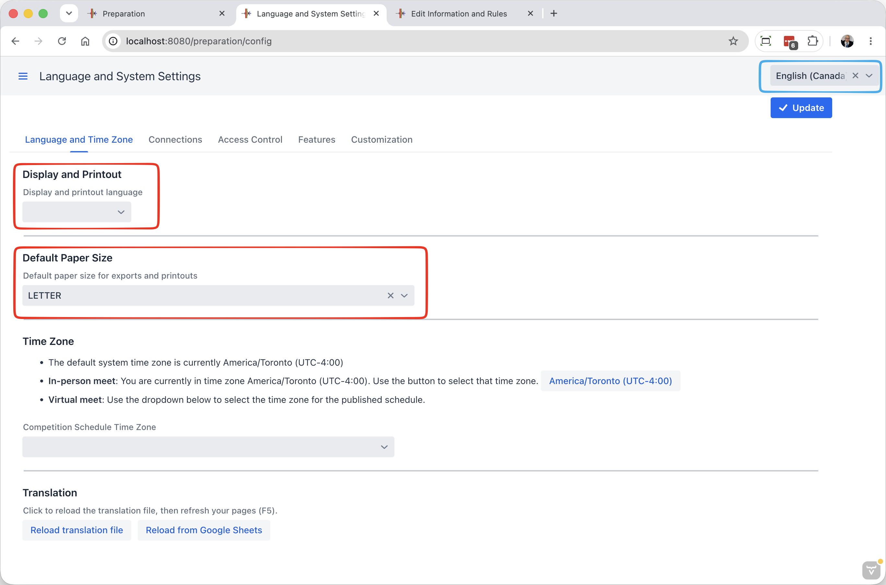

The second button in the group gives access to the technical settings for the application.

### Language and Time Zone

- Use this tab to set the default language that will be used on all screens and for documents produced. Individual users can select the language for their own session (for example, if the Marshal speaks Spanish, they can switch their own screen).
- The system will propose a default paper size based on your time zone.  For locations that use more than one paper size, you can pick which one you want.
- You do NOT need to set the time zone if you are running locally, or on a cloud server that is in your own time zone.

### Advanced Technical Settings

See this [page](2120AdvancedSystemSettings) for details about technical settings used to control access, connect to complementary applications, etc.
