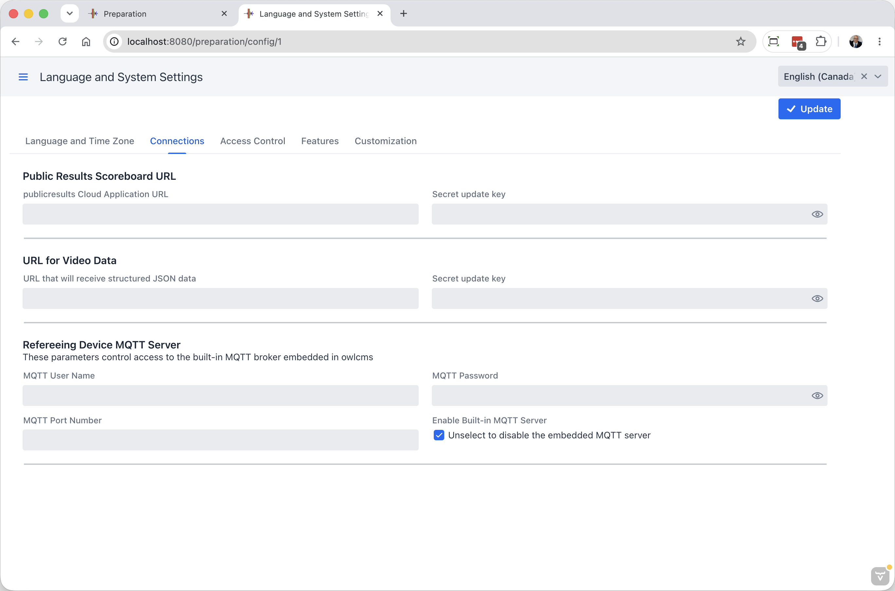
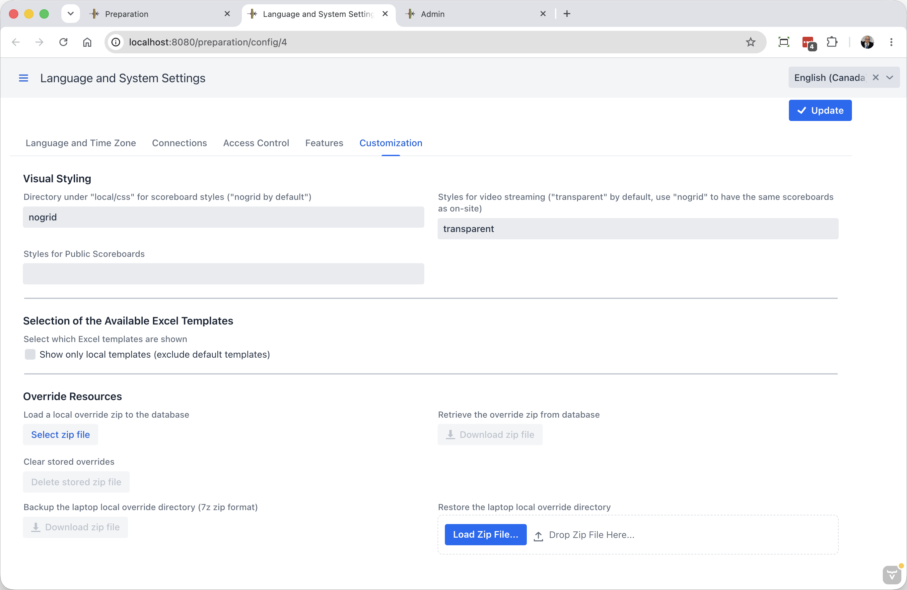

## Advanced System Settings

These settings are used when running large competitions, or when running in the cloud.

### Connections

#### External Event Feeds

The first two sections are completely interchangeable; their names are historical and reflect typical usage.  The selection of the format used depends entirely on what you put in as URL

- Public Results Scoreboard URL 
  - The `publicresults Cloud Application URL` is normally refers to a [Tracker](Tracker.md) program running in the cloud.   It will take the form `wss://scoreboards.fly.dev/ws`  (where scoreboard is the actual name of the application in the cloud).  To create a Tracker in the cloud, you will use the same steps as described on the [Cloud Installation](Fly) page, but you will use the Tracker and Shared Key sections.
  - The `Secret Update Key` is the one set using the Shared Key section.  There is normally one if the target is in the cloud
- URL for Video Data
  - There are two formats used for Video Data.  The first one is exactly the same as the scoreboard, except that video data is typically processed on a machine on the same network as OWLCMS.  So the difference is that the URL is of the form `ws://192.168.1.101/ws` where there is no encryption (ws instead of css, and typically a numerical IP address is used.)
  - For some applications developed before the websocket (ws) format, you can use the legacy HTTP version.  In that case, the URL is whatever the application specifies. On a local area network, it will probably be something like `http://192.168.1.101/video` as determined by the receiver.
  - The `Secret Update Key` is sometimes omitted when running on a closed local network with a dedicated router.

#### Refereeing Devices MQTT Server

This section is used if you wish to add protection to the OWLCMS server.  It is normally not used when running locally, and when running remotely you need to use secrets so the MQTT broker inside OWLCMS knows what to require `OWLCMS_MQTTUSERNAME` and `OWLCMS_MQTTPASSWORD` need to be set as secrets if security is expected.

### Access Control

This section controls who can access the system.

The settings are as follows.  In actual practice only the first (Password for Officials) is in common use.

- **Password for Officials**  When doing streaming, it is possible that you want to prevent the people running the video from accessing the technical official's consoles. A password will be required for the various technical official screens
- **Authorized IP addresses for Officials** For the same reason, you may want to instead (or in addition to password) use whitelisting.  Technical officials will be required to come from this network.  If running in the cloud but from a gym, this would be the public IP address shown by https://ip4.me/.
- **IP Addresses Authorized to Access Displays** and **Password for Displays**.  You may want to authorize a video production company to see your displays, likely without setting a password.  The screen password setting is there for symmetry and is unlikely to be used.
- **Backdoor Access IP**  This grants access without requesting a password, to all the technical official screens and displays.  Setting this value also enables access to two other pages that are normaly hidden
  - the `/simulstion`page to [launch a simulated competition](Simulation).  
  - The`/admin` page that is used for stopping the system and special data migration functions

### Features

The system has a large number of specialty features that can be turned on or off from this page. See [Feature Toggles])FeatureToggles) for information.

### Customization

This page has several sections that reflect the work that has been done to override/adjust the default OWLCMS styling and templates

- Visual Styling

  When started from the [Control Panel](Control Panel.md) OWLCMS copies 4 visual themes in the `local/css`directory

  - nogrid which is the usual theme for scoreboards
  - grid which is a legacy style where the scoreboard cells have borders
  - public which is used in large venues for a fancier display without the athlete information at the top
  - transparent which is like public, but with no background so that, when streaming, video software can put the live camera in the back.

  These files can be edited as explained in the  [Scoreboard Styling](Styles) page

  - `Directory for scoreboard styles`:  normally `nogrid`
  - `Styles for video streaming`: normally `transparent`
  - `Styles for public scoreboards` If unspecified, `nogrid`.  You may also choose `public`

- Selection of the available Excel templates

  The system comes with predefiined document templates. Federation can edit them to their liking and name them as they prefer (for example to translate the names).  In which case the ones in `local/templates` should replace the default ones and the default ones should be hidden.  Use the `Show only local templates` checkbox to hide the OWLCMS-provided templates.

- Overrride Local Resources

  This is normally used in cloud settings.  In the cloud there is no persistent file storage except the database.  So the system provides for a way to package a customized `/local` and store it in the database.

  The process is done locally, on a laptop, until satisfied that the age groups, championships, templates, styles, etc. are all correct.  Then the buttons in this section are used.

  - `Backup the laptop local override directory` To create the zip you can use the system zip commands, or use this button.  We recommend that you only keep the files you actually override in your zip -- remove anything you don't need to change.
  - `Load a local override zip to the database` the selected zip is stored inside the database.  From that point, the normal retrieval is turned off (files on disk in /local, and OWLCMS-default files are not used)
  - `Clear stored overrides` This removes the zip from the database.  The normal lookup (files on disk and files inside the OWLCMS distribution) is restored.
  - `Retrieve the override zip from database` This allows you to get back a zip from a cloud installation.
  - `Restore the laptop local override directory`. You can use the first "Backup" button to take a snapshot of your local files without using the system zip commands.  You can restore a backup this way.  Or, you can use this button to take a backup of a cloud setup, and to modify it at a later date, use this button to unzip it to your laptop without using the system zip commands.
