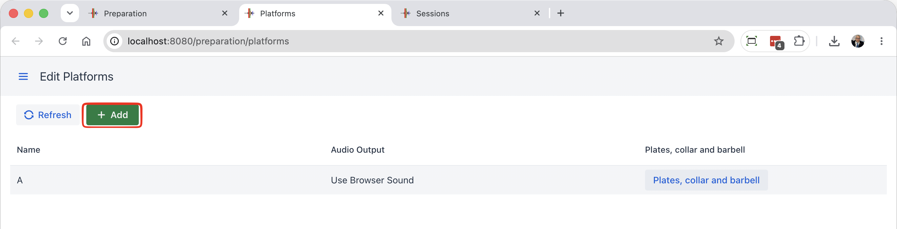
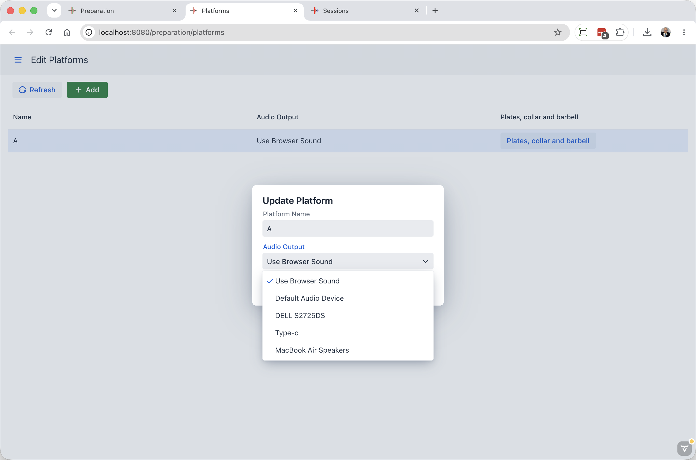
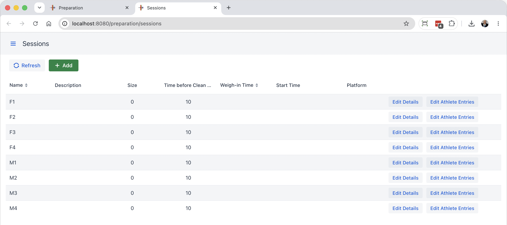
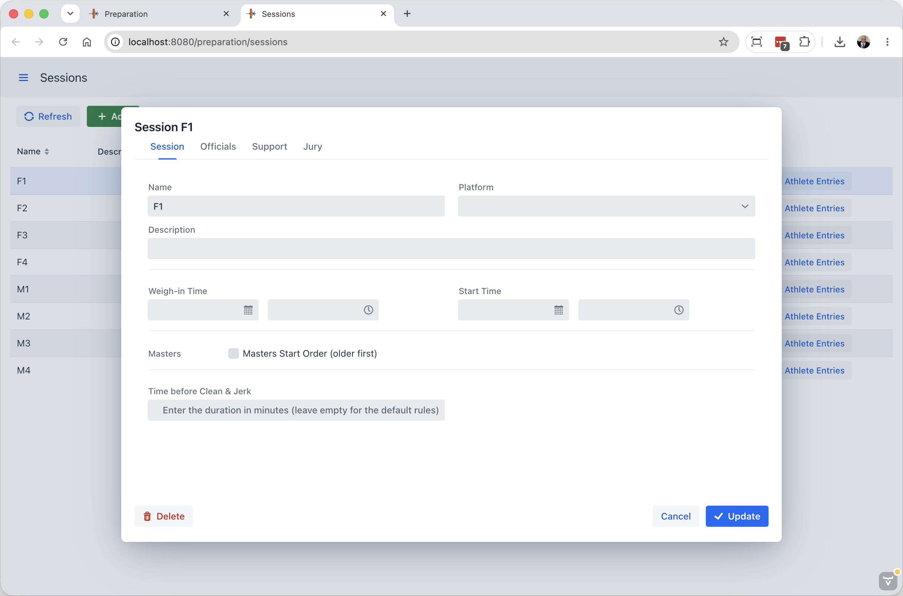
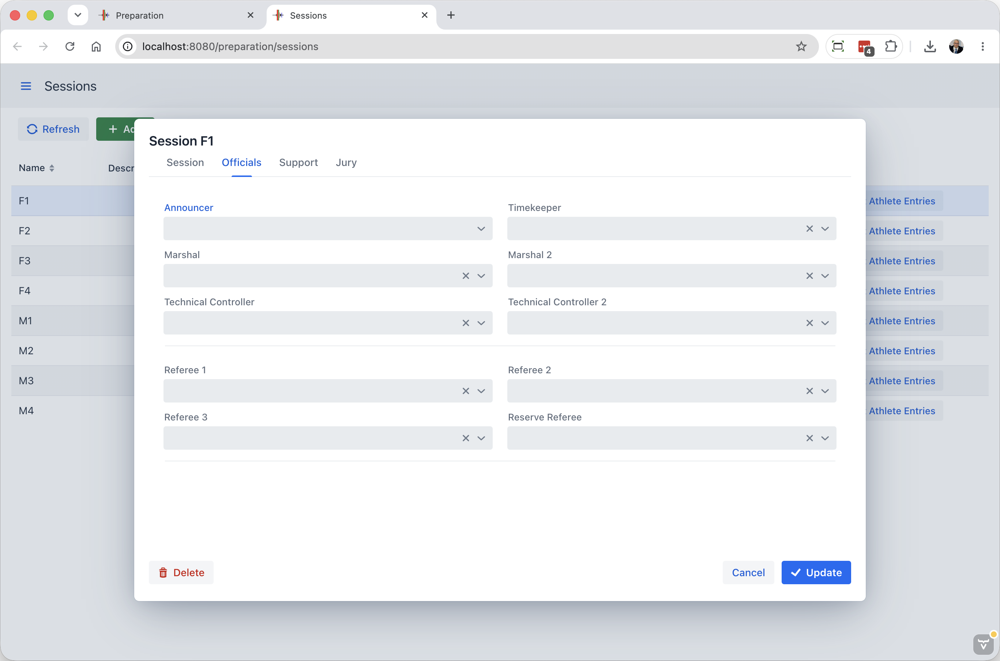

When organizing a competition, it is typically known in advance how many athletes are expected, and whether it will be a 1, 2 or 3+ platform competition.  It is often the case that a rough list of sessions of 4 or 5 sessions per day per platform is created so that when athlete registrations come in, assignment work can begin.

A normal sequence is to define the platforms, then map the sessions to the platforms

## Defining Fields of Play (Platforms)

OWLCMS supports multiple competition fields of play used at the same time. A field of play corresponds to a platform and the corresponding warm-up area. Displays and technical official screens are associated with a field of play.

Using the Add button allows you to create additional fields of play. Clicking once on a platform in the list allows you to edit it. This is useful if you want to rename the platform.

Clicking on the platform line allows you to rename or pick the audio output

If you only have one platform the normal options are

- Use browser sound: you do this when you can connect speakers to the laptop in front of the athlete, or if that laptop has loud enough sound.
- The other entries in the list refer to the computer running OWLCMS.  The sound will come from the laptop, and you can connect the speakers to the main laptop, or feed it to a mixer, or send it to the venue sound system.

If you have multiple platforms, the typical choice is browser sound.  If you wish to use system-generated sound, you will need to have USB adapters for each platform. The easiest way to add more (in addition to the audio headset jack) is to use an [analog USB converter](https://www.amazon.com/UGREEN-External-Headphone-Microphone-Desktops/dp/B01N905VOY/ref=lp_3015427011_1_5?s=pc&ie=UTF8&qid=1564421688&sr=1-5) -- do not use digital or wireless connections; they introduce perceptible lags and are needlessly expensive.

Notes:

- If you have an MQTT down signal, make sure to turn off the sound on the athlete-facing browser so there is no confusion.

## Defining Sessions

If you load an empty database, the sessions screen looks like this, with all sessions empty.  If you have used the Excel spreadsheet method described on the [Registration](2200Registration.md) page, there will be athletes assigned to the sessions.

Clicking on a session brings up an editing popup with tabs.

#### Session

This is used to assign the session to a platform and edit the weigh-in and start times.  If the session is a Masters session (older age groups presented first, and receiving medals first), use the checkbox.

You can also override the duration of the break if it changes while the competition has started.

#### Officials

Often, officials will be determined in advance; see the [Technical Officials Assignment](5100TechnicalOfficials) page for details.  If a list of technical officials has been provided, you can select by typing in the drop box.  This screen is typically used for last minute changes, or for small competitions.

#### Support

The support staff screen works the same as the Officials.

#### Jury

The jury tab works the same as well.
