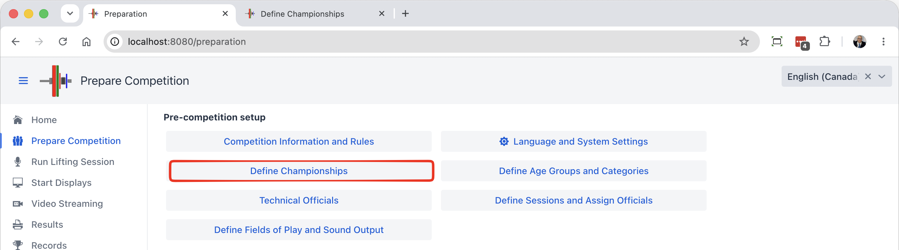
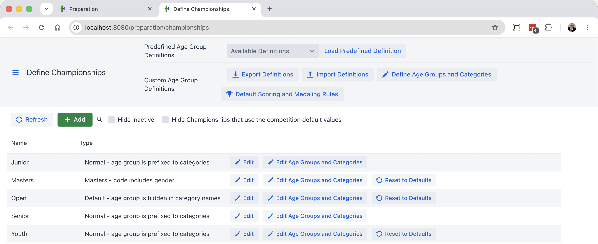
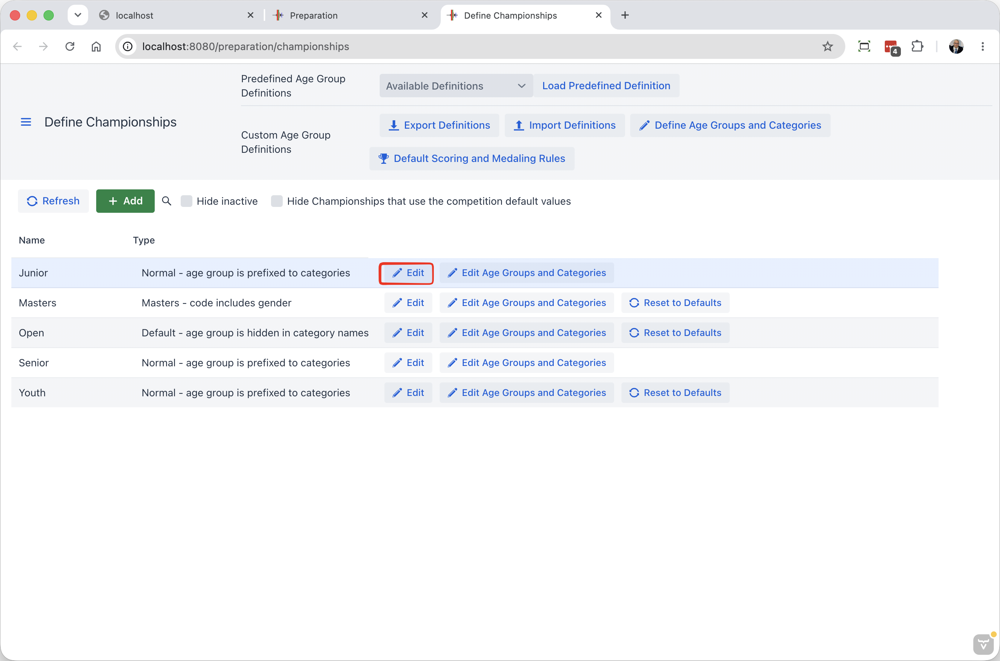
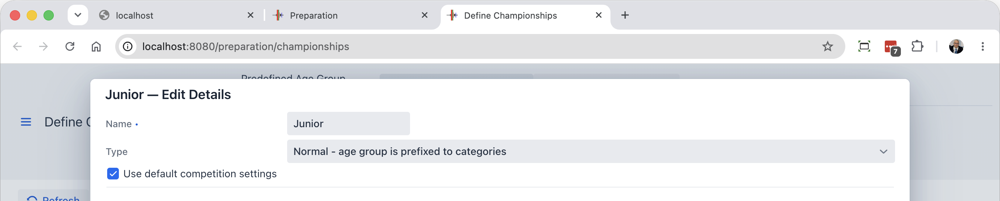
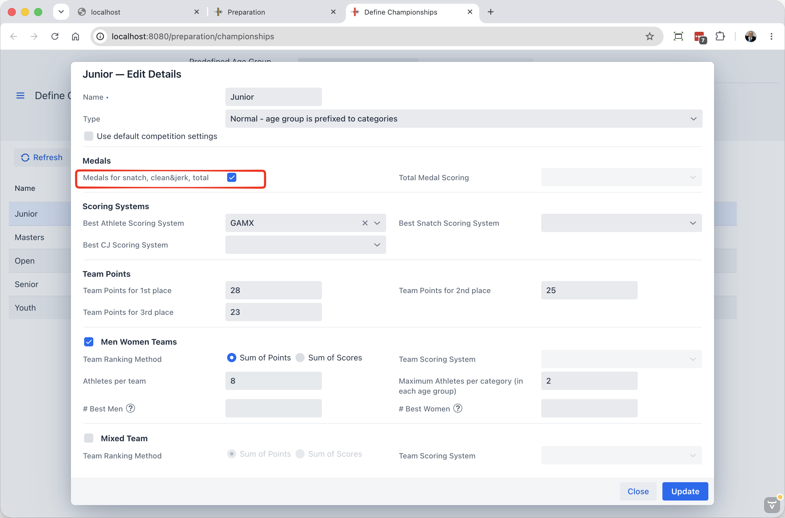
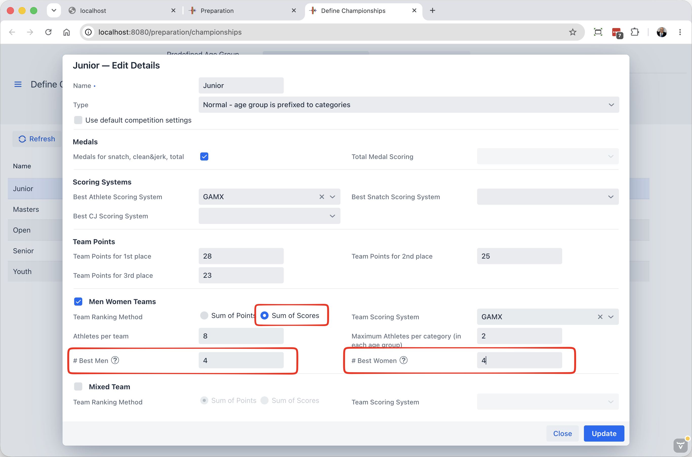
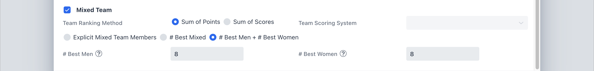
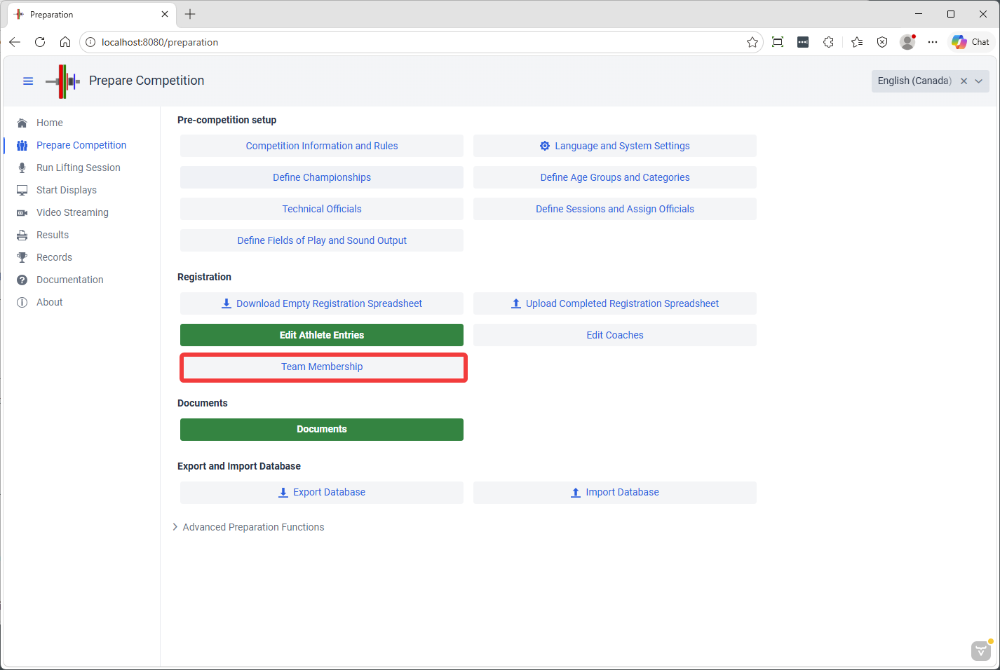
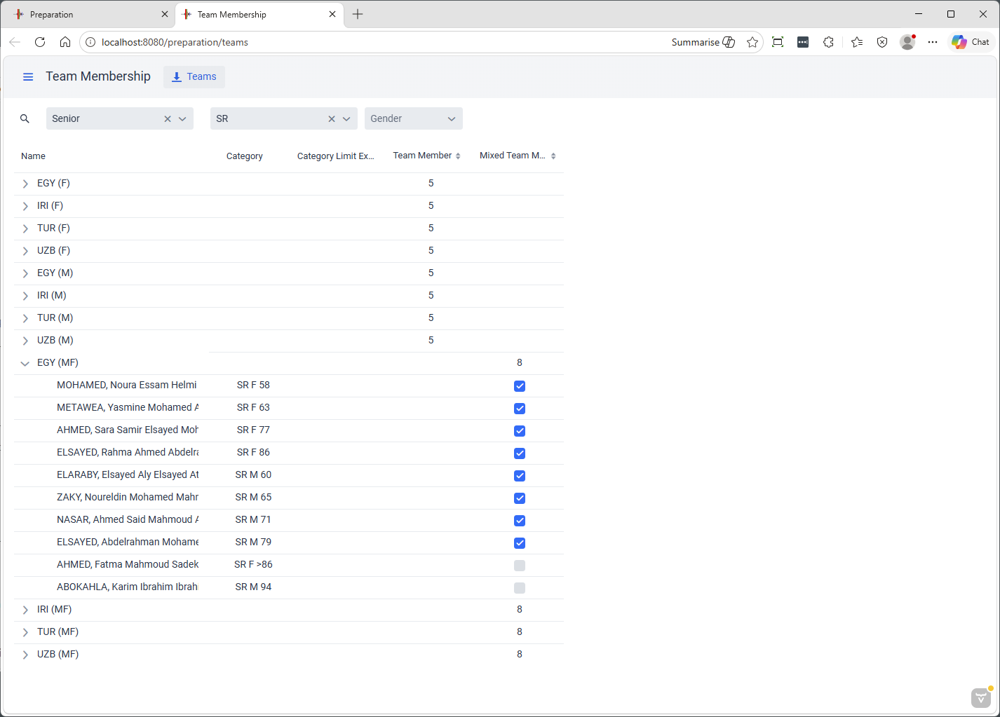
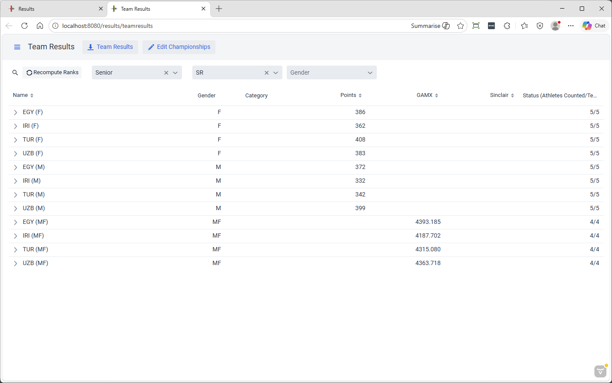

In OWLCMS a Competition can have multiple Championships being held at the same time. A championship defines a set of awards for part of a competition. Each Championship

- Is linked to a set of age groups.  Normally a men age group and a women age group.  Sometimes several -- Masters age groups are the typical exception.
- Determines if there are medals for total only or for each of the lifts
- Determines if medals are awarded on the weight lifted or on some other score (for example, the 3 best Sinclair scores)
- Determines the scores used for best athlete awards
- Determines if team awards are given and how they are computed.

To edit championships, use the Define Championships button on the Prepare Competition page

This brings up a list of championships

You will observe that some championships have a "Reset to Defaults" button.  These championships have one or more settings that differ from the default defined on the Competition Rules page.  This is completely normal; the Competition-wide default is just a convenience for commonly used values.

### Age Groups

Age groups and the bodyweight categories are the building blocks for championships.  

- You define championships first, so you can connect age groups to the championship they belong to.
  - You can also create an age group without a championship -- A championship with the same name will then be created.  This is common for Youth age groups (Say a U15 championship)
- An age group can belong to a single championship -- it is the age group that will
- This is why there is a JR M age group with the same categories as a SR M age group. You assign the JR M and JR F categories to the Junior championship.
- If you have two Senior Championships going on at once (say a National and a Continental), you would create additional age groups with a different codes (say SR for the continental and CanSR for a Canada Senior)
- For Masters, it is the same. If you have two Masters championships going on at once (say a National and a Continental), you need to duplicate the age groups and give them different codes. 

### IWF-Style Championships

As a first example, we use a traditional Junior Championship. We observe that it is identical to the Competition defaults  

And opening it confirms

We intentionally uncheck the "Use default values" checkbox to change the medals that can be won so all 3 medals are given out.

In this example,

- There are medals for snatch, clean and jerk, and total.
- The best Athletes are determined using GAMX as adopted by IWF
- Team points follow the normal IWF rules 28 25 23 then 22, 21, etc.
- Teams win according to the sum of points
- There are 8 athletes per team, maximum 2 per category.   
  - Team Selection is explicit and  is explained [Below](#team-selection)

Rules can then be adjusted as we want, and apply to the championship

- Smaller teams, smaller limits per category
- Use different rules for the team (take top N men and top M women, for example)

### **Score Based Awards**

Many federation use score-based systems to assign a score to a team.,  This is done by changing the radio button and selecting a scoring system.  For example we can change the team awards so the team with the best sum of GAMX wins, counting the top 4 men and top 4 women respectively.

### Mixed Championships

Historically, mixed teams championships are defined by adding the points of the men and women teams.  The example below does this

- The format selected is "sum of points"
- We take the best 8 (that means all) points for men and the best 8 women (there are 8 maximum)
  - This is not really practical, so it would likely be something like 4 best of each gender, or an explicit team selection

### **Score-based Mixed Championships**

There are now scoring formulas such as the GAMX series that are equitable for men and women, such that it is possible to add men and women scores together. "Sum of Scores"  is selected

- In this example, we use the top 4 men scores and the top 4 women scores.

### Team Selection

To create Explicit Teams as in traditional IWF-style competitions, or for explicit mixed teams, use the Team Membership button on the Prepare Competition page

In this example, the teams were defined to be 5 persons for the gendered teams and 8 for the mixed team

Opening each section allows selecting who is on the team or not using the checkboxes.

> Note that the [Registration File Format](2300EditAthleteEntries.md) supports team membership annotations.  By default
> the athletes are assumed to be part of their gendered team.  This can be changed by adding `/-T` after the category.
> When a mixed team championship requires explicit membership, you can add `+MT` to the markers.
> 
> So `JR M 60/+T,-MT` is valid (this would state that the athlete is part of the gendered team, but not of the mixed team).  `+T` is the default, `-MT` as well.

### Team Results

The results page has a dedicated area for team results

This shows the totals per team

And the details

A summary spreadsheet with the Men Women and Mixed results can be downloaded as well
