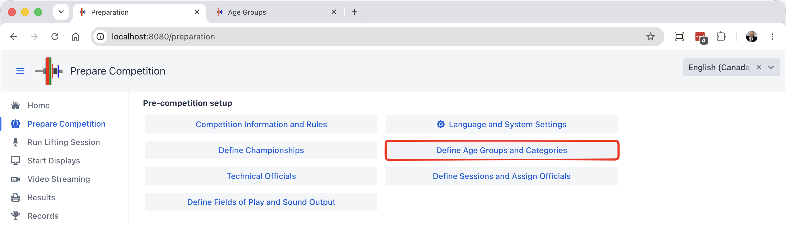
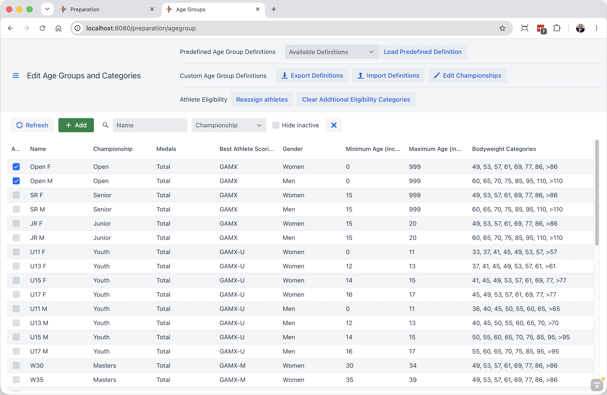
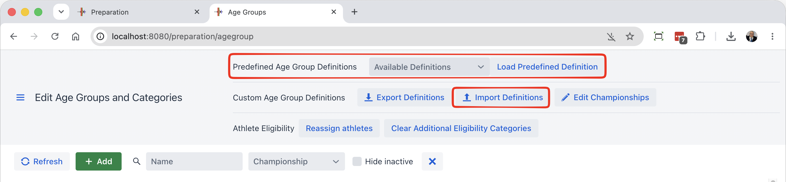

When running a competition, it is necessary to define the Categories and Age Groups that will be used.  

This is done from the Define Age Groups and Categories page

This opens a page with all define Age Groups.  By default OWLCMS create the IWF age groups, a common set of youth age groups, and the Masters age groups.

## Active and Inactive Age Groups

In many competitions, an athlete may be eligible to compete in more than one age group.  A typical example is a 16-year-old athlete that would be eligible to Youth, Junior, Senior and Open medals in the same meet.

To facilitate registration work, OWLCMS supports a typical registration method done by entering the athletes' bodyweight category. OWLCMS then assigns them to all age groups in which they fit. To support this convenient way, it is necessary to identify which age groups are active in the competition.

In the screen shot above, only the Open age group is active,and we see that it includes all ages 0-999. So a simple club competition can use this Open category. 

## IWF Age Groups

IWF Competition Age Groups are predefined.  Just select the applicable age groups from the list.  The program will automatically assign the athlete based on age, body weight and qualifying total, if defined.

If your championship has qualifying totals, you can edit the qualifying totals by going to the age group and clicking on the category. For example, lets define a qualifying total of 100 for Junior Men 55kg.  We click on the age group, then click on edit next to the category.

We type the desired total and click "OK".  You can do the same with the other categories.

NOTES:

1. Once we are done with all the categories, we click the blue Update at the top to save the Age Group.
2. Because this is time consuming, you may prefer to enter the qualifying totals using a spreadsheet.  See further down on this page.

## Editing Age Groups and Bodyweight Categories

Let's assume that we want to change the default U13 group to be U12, and also modify the bodyweight categories.

We change the code, and the minumum and maximum age range.

For the sake of our example, let's assume that the bottom category for U12 is 30kg, and so we add a category.

After pressing the green button, a 30kg category is added at the beginning.  

Let's now assume we want the heaviest category to be >64kg.  We don't want a 71kg category anymore.  If we delete it, the system will automatically adjust the heaviest category.

After Deletion, the categories are adjusted. The changes to the age group are only registered when you click on the blue "Update" button at the top of the form.

### Reassigning the athletes

After updating an age group with new categories, the program highlights the `Reassign Athletes` button at the top.  *Note that you will need to review team memberships after reassignment*.

## Adding an Age Group

Let's assume we need U23 age groups (one for female, the other for male).  In order to add a group, we use the `+` icon at the top of the table.  Let's add the Female U23 group:

We now fill in the information, and select Add.

## Notes for Masters Age Groups

The default list contains non-standard Masters age groups:

- some federations accept 30-34 year-olds in their Masters meets. If you don't want these age groups, simply leave them unselected.
- Similarly, some federations have gender-equality rules and include the same age groups for women as for men.  The default list allows you to select a W70 for 70-74 and a W75 group if you so desire..

- The applicability of the percentage rule (as opposed to the 20kg rule) is based on the category in which the athlete is registered.  If an athlete has a Masters category selected, he is expected to lift in a Masters group, where the rule will apply to all lifters.  In a mixed group with senior and Masters lifters, the which rule applies would depend on the lifter.  The fairest rule would be to set the category to Senior for all athletes: Because they are qualified as Masters, the dual eligibility athletes can still appear in the Masters result sheets.

## Loading an Age Group Definition File

The are predefined age group files that can be loaded, or you can load a custom one you created or were given  (see [Age Group and Categories Definitions](5040AgeGroupDefinitions))

