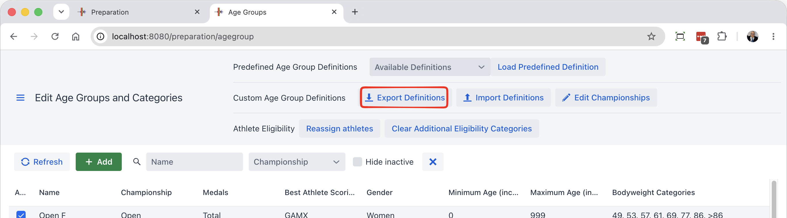
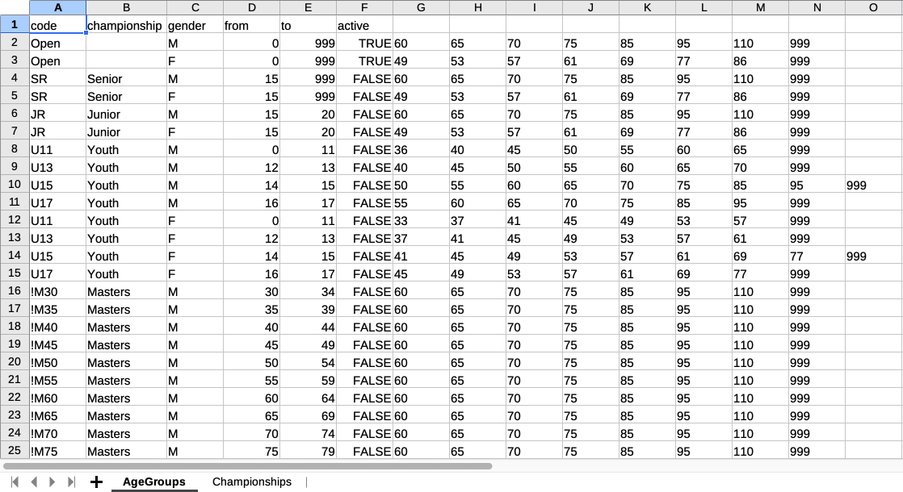

## Creating an Age Group and Championships Definition File

If you look at the installation directory under the `local/agegroups` directory, you will notice files with a name similar to `AgeGroups.xlsx` .  

The way to create your own is to first export one from the Age Groups page.

### Age Groups Tab

The Age Groups tab matches the information entered interactively.  The name in the Championship column should match exactly one in the Championships tab, or be left empty.

In the following example, there would be a single "best athlete" amongst all Youth.  Otherwise, we would put U11 as the championship name for the U11 age group. and so on.

### Championships Tab

The `Championships` tab describes the championship-specific settings used by the age groups. Each row defines one championship. Boolean columns use `true` or `false`. Set `useCompetitionDefaults` to `true` to inherit the competition-wide defaults; otherwise, fill in the settings that are specific to this championship.

The recommended way to learn the layout is to configure the championships using the interactive `Define Championships` form, export the age groups, and use the exported `Championships` tab as the starting point for your file.

The spreadsheet uses the same defaults and precedence rules as the interactive `Define Championships` dialog.

- If an age group names a championship that has no matching row in the `Championships` tab, it uses the default championship, which reads the competition-wide settings.
- The competition-wide defaults are the settings from the competition rules and team rules: medals for snatch, clean and jerk, and total; the competition scoring system; team points for first, second, and third place; men's, women's, and mixed team counting limits; maximum team size; and maximum athletes per category. Best athlete, best snatch, and best clean and jerk scoring also default to the competition scoring system.
- If a championship row has `useCompetitionDefaults` set to `true`, those competition-wide defaults take precedence for `scoringSystem`, `bestAthleteScoringSystem`, `bestSnatchScoringSystem`, `bestCJScoringSystem`, `snatchCJTotalMedals`, `teamPoints1st`, `teamPoints2nd`, `teamPoints3rd`, `mensBestN`, `womensBestN`, `mixedBestN`, `maxTeamSize`, and `maxPerCategory`. The row still supplies the championship `name` and `type`.
- If `useCompetitionDefaults` is `false`, the championship row values take precedence for those fields. Blank `teamScoringSystem` or `mixedTeamScoringSystem` means sum of points; a scoring-system value means sum of scores using that system. If `snatchCJTotalMedals` is `true`, the medal `scoringSystem` is ignored, because medals are awarded separately for snatch, clean and jerk, and total.
- Mixed team selection follows the same precedence as the dialog: `explicitMixedTeamMembers=true` uses explicit mixed team members and `explicitTeamSize`; otherwise a positive `mixedBestN` counts the top N mixed results; otherwise `mixedMensBestN` and `mixedWomensBestN` count men's and women's results separately.
- If `maxTeamSize` is blank, the roster limit defaults to 8. If `maxPerCategory` is blank or 0, the per-category limit defaults to 2.

The radio button choices in the interactive dialog are represented by the presence or absence of values in the spreadsheet.

| Dialog choice | Spreadsheet values |
| --- | --- |
| Men/Women team ranking by sum of points | Leave `teamScoringSystem` empty. |
| Men/Women team ranking by sum of scores | Set `teamScoringSystem` to the scoring system to use. |
| Mixed team ranking by sum of points | Leave `mixedTeamScoringSystem` empty. |
| Mixed team ranking by sum of scores | Set `mixedTeamScoringSystem` to the scoring system to use. |
| Mixed team members selected explicitly | Set `explicitMixedTeamMembers` to `true` and set `explicitTeamSize`. |
| Mixed team uses the top N mixed results | Set `explicitMixedTeamMembers` to `false` and set `mixedBestN` to a positive number. |
| Mixed team uses separate men's and women's counts | Set `explicitMixedTeamMembers` to `false`, leave `mixedBestN` empty or 0, and set `mixedMensBestN` and `mixedWomensBestN`. |

| Column | Meaning |
| --- | --- |
| `name` | Championship name. This must match the `championship` value used by rows in the `AgeGroups` tab. |
| `type` | Championship type or age division used for this championship. |
| `useCompetitionDefaults` | If `true`, the championship inherits the competition-wide defaults. |
| `scoringSystem` | Scoring system used for medals and ranking in the championship. |
| `bestAthleteScoringSystem` | Scoring system used for best athlete awards. |
| `bestSnatchScoringSystem` | Scoring system used for best snatch awards. |
| `bestCJScoringSystem` | Scoring system used for best clean and jerk awards. |
| `snatchCJTotalMedals` | If `true`, medals are awarded separately for snatch, clean and jerk, and total. |
| `teamPoints1st` | Team points awarded for first place. |
| `teamPoints2nd` | Team points awarded for second place. |
| `teamPoints3rd` | Team points awarded for third place. |
| `mensBestN` | Number of men's results counted for team scoring. |
| `womensBestN` | Number of women's results counted for team scoring. |
| `teamScoringSystem` | Scoring method used for team results. |
| `maxTeamSize` | Maximum number of athletes on a team. |
| `maxPerCategory` | Maximum number of team athletes counted per bodyweight category. |
| `mixedTeamEnabled` | If `true`, mixed team scoring is enabled for this championship. |
| `mixedTeamScoringSystem` | Scoring method used for mixed team results. |
| `explicitMixedTeamMembers` | If `true`, mixed team members are selected explicitly. |
| `explicitTeamSize` | Number of athletes required when team membership is explicit. |
| `mixedBestN` | Number of overall mixed team results counted. If empty or 0, the overall mixed-results mode is not selected; use `mixedMensBestN` and `mixedWomensBestN` instead. |
| `mixedMensBestN` | Number of men's results counted for mixed team scoring. |
| `mixedWomensBestN` | Number of women's results counted for mixed team scoring. |

This step needs to be done on a local installation.  Once you are ready, you can upload you local settings to a cloud installation, as explained in [this page](UploadingLocalSettings)

Let's say we want to create age groups for our annual U15 U17 competition.  We go to the local/agegroups directory, and copy the `AgeGroups.xlsx` file to another name (for example `AgeGroupsU15U17.xlsx` or whatever suits you).

In the example above, the cells outlined in red is interpreted to mean that in women's <u>category U17 F59, the qualifying total is 77</u>

So in this example

- there are four age groups defined (U15 and U17 for women, U15 and U17 for men)
- the four groups are active (column G)
- from column H onward, each cell defines the body weight categories and (if present, the qualifying total)
  - The U17 female group has bodyweight categories F40, F45, F49, F55, F59, F83 and so on.
  - The first part of each cell is a **bodyweight category code** that **must match** one of the codes defined in the first tab of the spreadsheet (`BW Categories`)  **If you need additional categories, add them in the first tab*.*
  - When a number is present after the category code, it is the qualifying total
  - Empty cells are ignored

## Loading the Age Group  Definition File

The drop-down at the top of the page shows the available files.  After loading the file, the athletes will automatically be reassigned.

