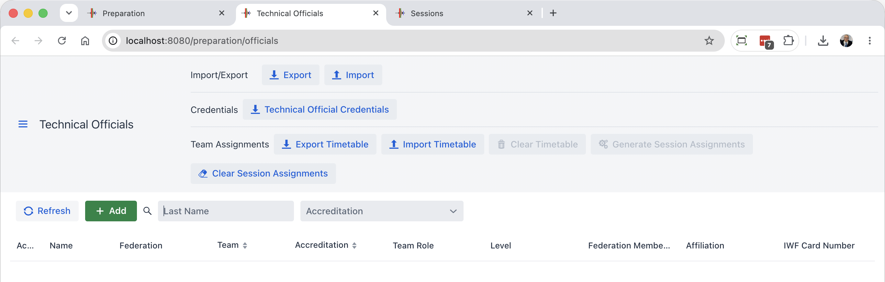
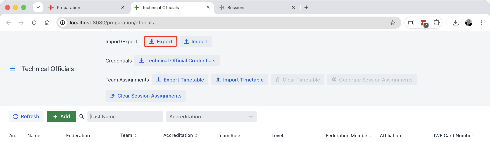
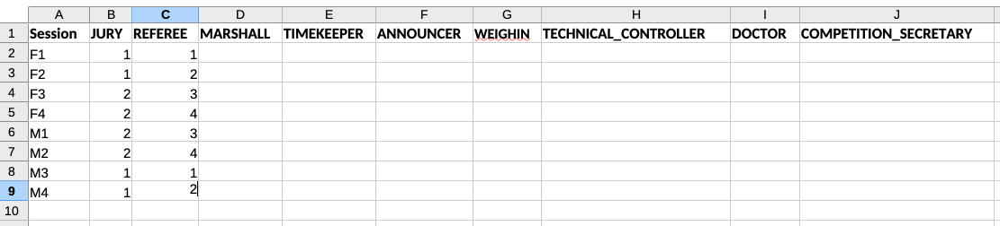

There are two main modes for assigning officials to sessions.

- [Direct Assignment](#direct-assignment) is when referees are freely assigned by the organizers
- [Team-based Assignment](#team-based-assignment) is typically used in large IWF-style competitions.

## Defining Available Officials

In both styles of assignments, the first step is to define the available officials.  This is done from the Technical Officials button in the Prepare Competition section

Use the Add button to add each official.  The available fields are as follows

| Field                    | Purpose                                                      |
| ------------------------ | ------------------------------------------------------------ |
| Active                   | Active or not in the current competition                     |
| Accreditation            | This is normally "Technical Official"; other values such as "Competition Secretary" or "Information System" may be used when producing Credential cards. |
| Last Name                |                                                              |
| First Name               |                                                              |
| Level                    | This is the certification level (e.g., IWF 1, etc.)          |
| Federation Membership Id | The membership ID can be used on protocol sheets or other documents (some federations keep statistics) |
| Federation               | The name/country code/state code of the Federation of the official. |
| Affiliation              | Typically a club within a Federation                         |
| IWF Card Number          |                                                              |
| Team                     | When using team-based assignments, 1 2 3 or 4                |
| Team Role                | Combined with the team number.  Referee combined with Team 1 will allocate the technical official to the "Referee 1" team. |

## Direct Assignment

With Direct Assignment, you create the list of Technical Officials first.  We suggest you enter a few interactively, then use the Export button at the top

You can then finish the list of technical officials.

Then you have two options:

- Use the Sessions editing page to select the officials using a drop down, or
- Use the SBDE format to assign the referees.  Use the Advanced section at the bottom of the preparation page.

For one-platform or one-to-two-day competitions, using the web interface is often fast enough.

## Team-based Assignment

For team-based assignments you need to proceed in a systematic way

1. Define your sessions. Order the sessions according to the platforms and scheduled times.
2. Use the Export Timetable button to get a time table template
3. Fill the time table with numbers -- the number represent the team number. 
   
4. Import the timetable
5. Generate the Session Assignments
6. Adjust Exceptions manually.