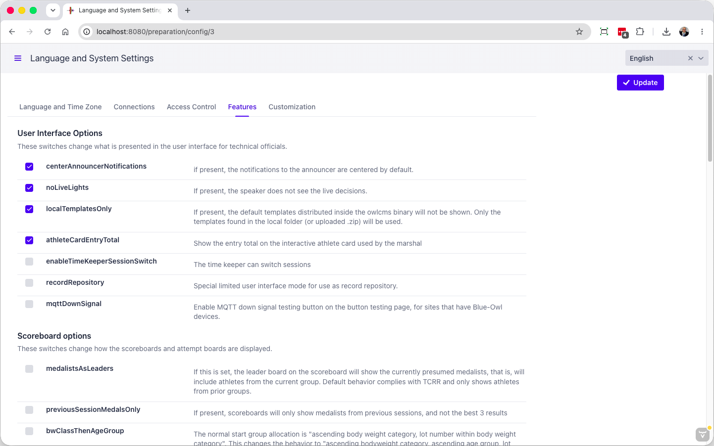

Feature Switches (also known as Feature Toggles) are parameters that can be turned on or off to change the application behavior.  They complement the options in the rest of the interface.   

To access the list, use to the Languages and System Settings button from the "Preparation" page and select the tab.
The options are documented on the page itself (with translations)

