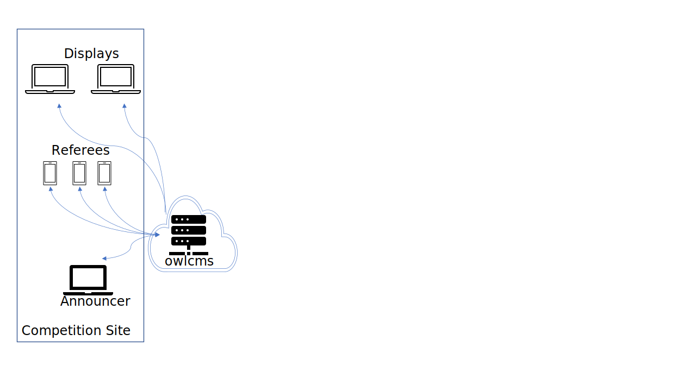
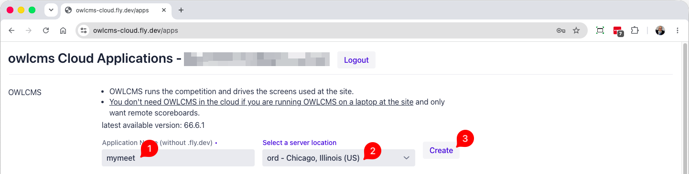

In a Cloud-based installation, all that is needed is browsers (and a good internet connection). This is a good option for club competitions since many clubs have wifi.

### Cloud-Based Setup

When using a cloud-based setup, especially for club meets, the only requirement is to have devices that connect to a local area wifi.  All the various display screens and devices connect to the cloud through the wifi.  In a simple club meet, flags are often used for refereeing (the [speaker enters the decisions](Refereeing.md#manual-refereeing)) or to use [phones as refereeing devices](Refereeing.md#mobile-device-refereeing).

### Fly.io

To run on the cloud, the simplest solution is to run on [Fly.io](https://fly.io).   Fly.io is a cloud service that is, in effect, free, because the monthly charges are extremely low (2 to 3US$), below the minimum billable amount of 5 US$

When running on fly.io, you get your own personal copy of OWLCMS and of all your data.  OWLCMS only provides an application dashboard to run the installation and upgrade commands on your behalf.

### Login to the Dashboard

The first step is to open the installation application at  https://owlcms-cloud.fly.dev . Use the login button to proceed.

You need a fly.io account to proceed.  If you don't have one, use the black button to create an account. You will need a credit card number, but as explained above, it will not be charged.  Once you have an account, enter your fly.io credentials and login.

The applications that will be created will belong to you.  The only thing the application does is type commands for you.  At any time, you can switch to using the fly commands directly and do what you want.

### Create a cloud-based OWLCMS

1. Type the name you want for your owlcms site.  The suffix `.fly.dev` will be added to create the site location. In this example, this would be [https://mymeet.fly.dev](https://mymeet.fly.dev)   If you own a domain name, you can later alias [a name you own](https://fly.io/docs/apps/custom-domain/).

2. Select a location in the world where the owlcms will run.  There are more than 20 available.  The locations are normally shown to you from the closest to the farthest to where you are.  However, it is usually preferable to pick one in your own country, even if it is further than one in a neighboring country.

3. Click the Create button.   An area at the bottom of the page will appear to show you the work being done.

4. You are done.

### Additional Modules

It is possible to connect your OWLCMS to additional modules, for example to provide scoreboards that can be watched on any phone connected to the internet.  To do so, activate the TRACKER module further down on the same page, and set a Shared Key, also on the same page.
