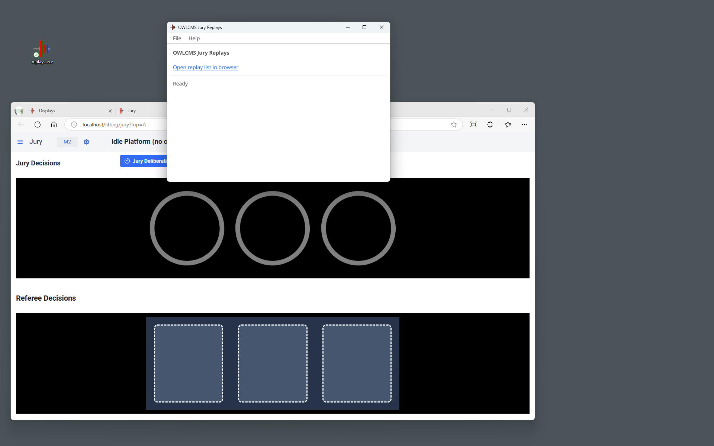
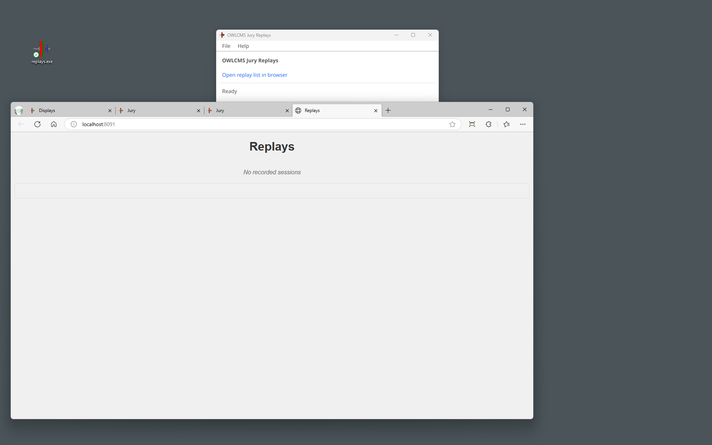
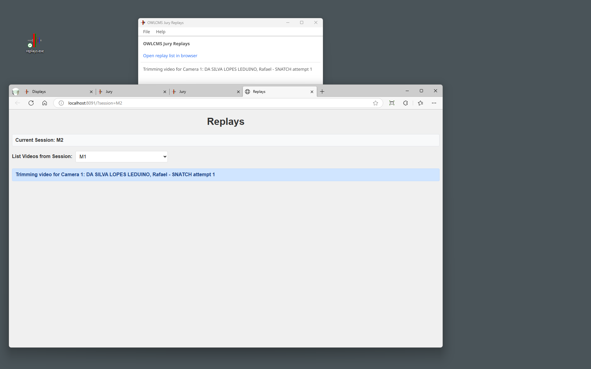
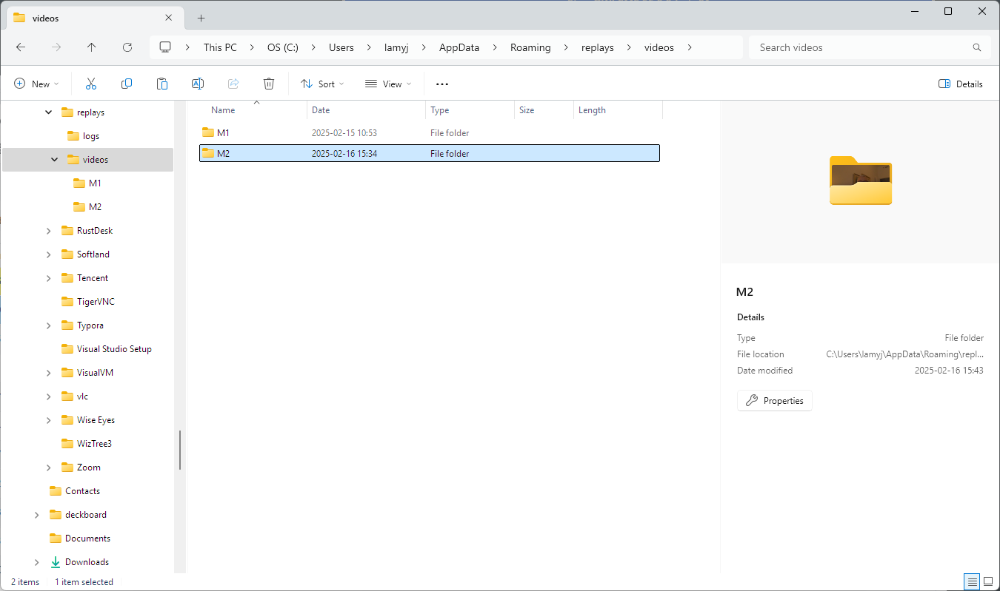
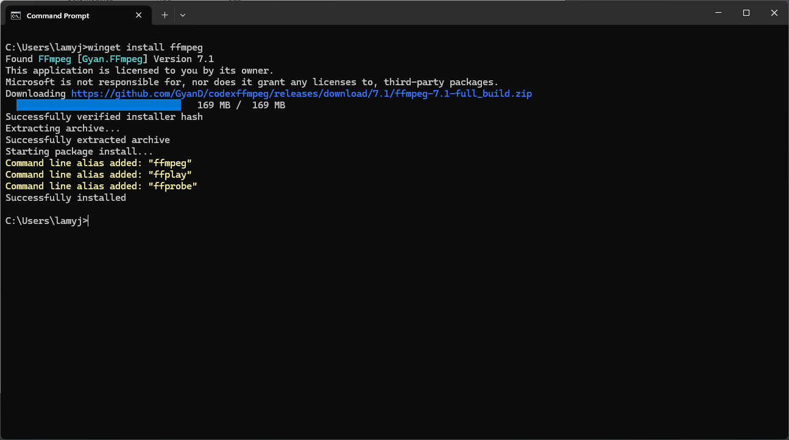
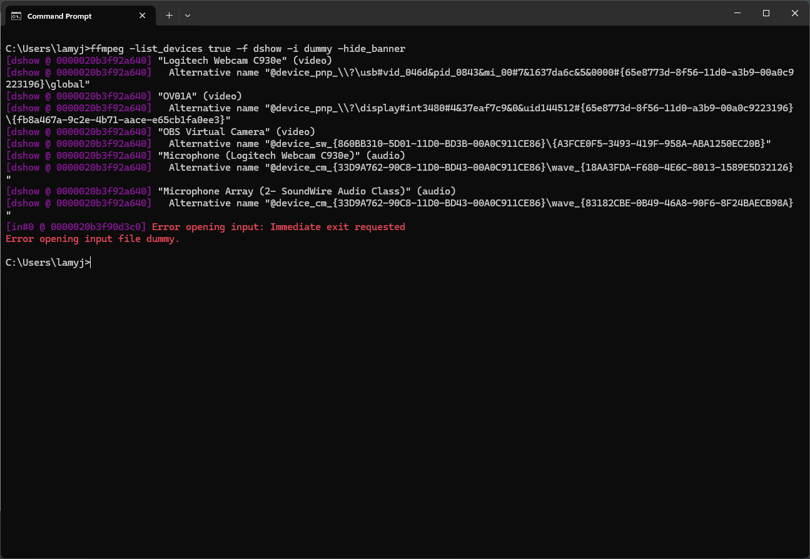
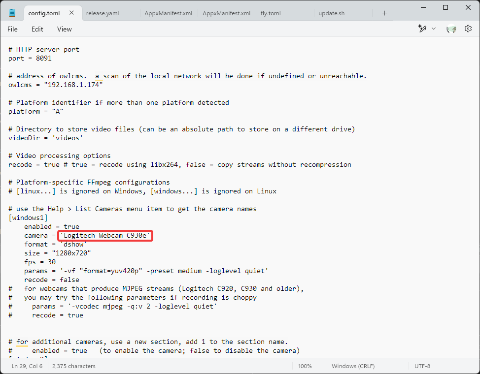

# Self-Service Jury Replays

There is an auxiliary module to owlcms called `replays` that provides automatic recording of the lifts and makes them available to the jury.  Multiple cameras are supported. The lifts are automatically trimmed to start a little before the lift and stop after the decisions have been shown.  The jury can watch them using a regular browser, and the replays are organized by session and time (most recent first)

There needs to be one `replays` program running for each platform.   There are options to the replays program if you need to run several on the same computer.

First we show how the program is used, then we provide the configuration instructions.

### Using the Replay Program

The replays program will normally locate owlcms.  So the first thing to do is to start owlcms and wait that it shows its home screen.

> Reminder: You can click on each image to see it bigger.

***Announcer Screen***

The session has not been started yet, but owlcms is running.


***Jury Screen***

For simplicity, we assume that the `replays` program runs on the jury laptop.  But `replays` can actually run anywhere -- wherever is most convenient for your camera or cameras.

Once owlcms has started -- We show that the jury console and jury scoreboards are running.   So then we start the replays program.  If there is no address configured in the configuration file for owlcms, or if the address has changed, it will try to find owlcms -- it will show a "Scanning" message.  


After scanning, it will show "Ready", and you can click on "Open replay list in the browser"



Since we have not recorded anything at all, the web page that opens will be blank.  If you are running `replays` on a machine other than the jury because of your camera setup, you would use the URL shown at the top to open the page on the jury computer.



***Announcer Screen***

The announcer or timekeeper will start the time normally.  They have nothing special to do.


***Jury Screen***

The jury page will automatically switch to the current session and show that things are recording.  The recording page does NOT have to be visible, but if the screen is large enough you can make it visible at all times by dragging the tab to the side of the screen.


After the decision is made visible, the replay page will show that it is removing the dead time before the lift.



And then the video is made available in the list.  Videos are grouped by session and shown in most recent order first.  The athlete, attempt and camera angle are clearly identified.


To see a replay, one simply clicks on the video.  Whatever was in front of the camera during the time the clock ran is captured.  The video can be made full screen are looked again.  There is no slow-motion, but you can pause it.


When the clock starts again, the recording/trimming/ready sequence starts again.


### Accessing the Videos

You can access the videos by using the File program


You will then see a folder called `videos` and inside, the videos for all the sessions are properly named.



### RaspberryPi: Configuration of the program

**Installation** 

Download the program called `replays` (no `.exe`) from https://github.com/owlcms/replays/releases

Copy it to the Desktop where you want to use it

**Configuration**

There is nothing to do if you have only one device.  The `ffmpeg` program is already installed, and when you plug in a camera  the USB adapter will be on `/dev/video0`.
If you have more than one camera, open the configuration directory, use the Text editor, and copy the section several as needed, using `/dev/video1` and so on for the additional cameras.

### Windows : Configuration of the program

**Installation** 

Download the program called `replays.exe` (with `.exe`) from https://github.com/owlcms/replays/releases

Copy it to the Desktop where you want to use it

**Configuration**

Windows requires

- Installing the `ffmpeg` software to handle the recordings
- Configuring the cameras.

##### Installing Recording Software

The first time around, you will need to install the `ffmpeg` program that is used to do the actual recordings. To do this, click on the start menu and type `cmd` or open a terminal window.  Type the command

```
winget ffmpeg
```

You will then see output similar to the following



##### Camera Configuration

Once ffmpeg is installed, you can figure out what your cameras are named according to Windows.  This is critical.  Type the following command:

```
ffmpeg -list_devices true -f dshow -i dummy -hide_banner
```

You will then get an output similar to this one, listing all your devices


For our example, we will configure the camera called `Logitech Webcam C930e`

Go back to the applications directory using the `Open Application Directory` menu.

Find the `config.toml` file, that can be edited with Notepad


Then edit the cameras to have exactly the name as in the ffmpeg output.   Locate the `[windows]` section.

> Follow the carefully instructions for formatting -- include `video=` before the name, and enclose both inside `'` single quotes'



If you have more than one camera, remove the `# ` in front of the `[windows2]` section and create more sections `[windows3]` if needed.

Normally you don't need to change the other parameters.

