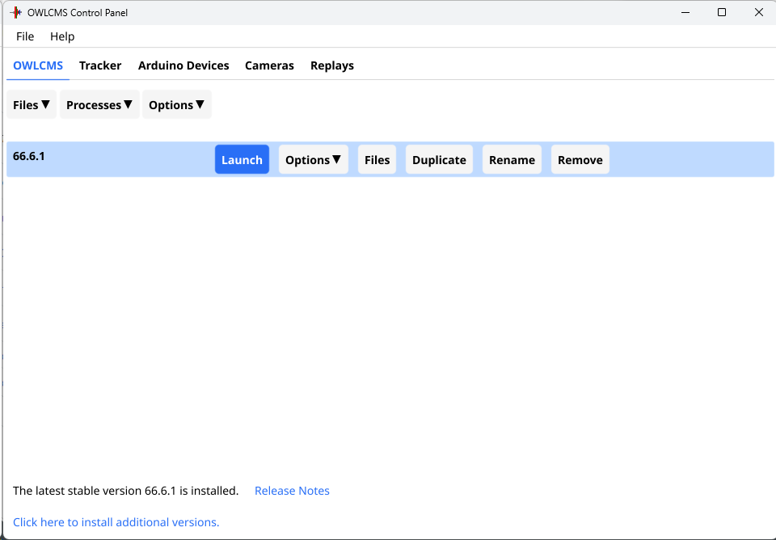
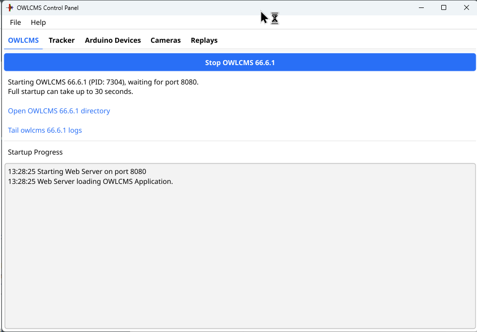
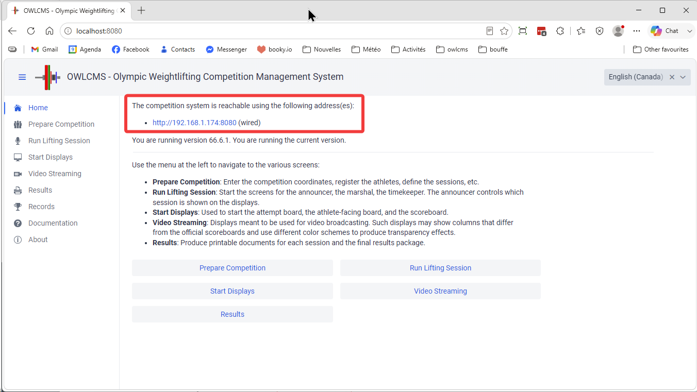
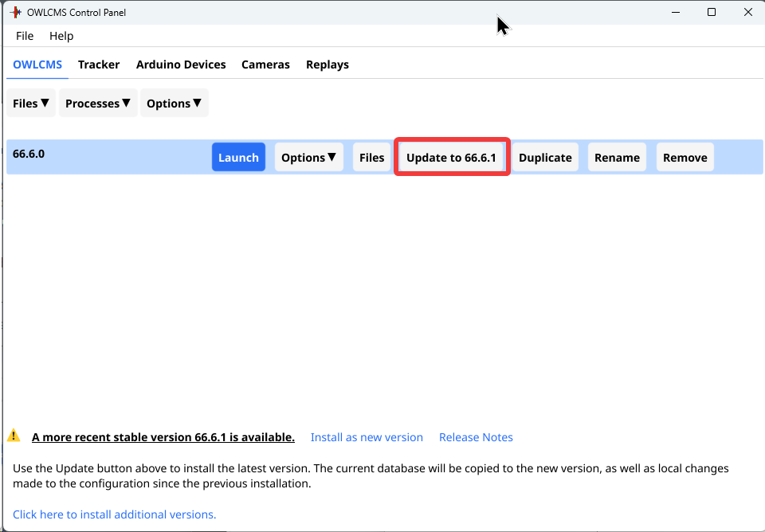
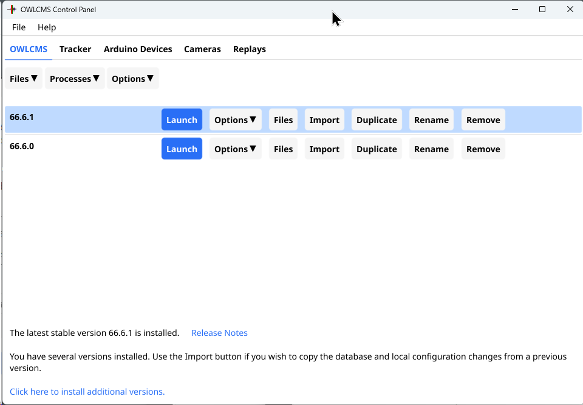
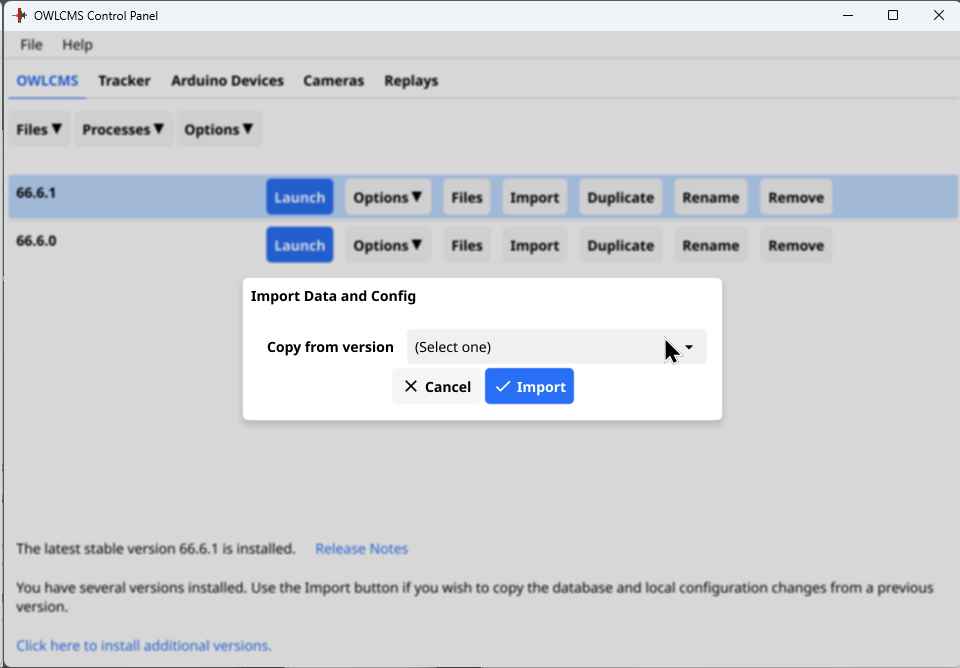
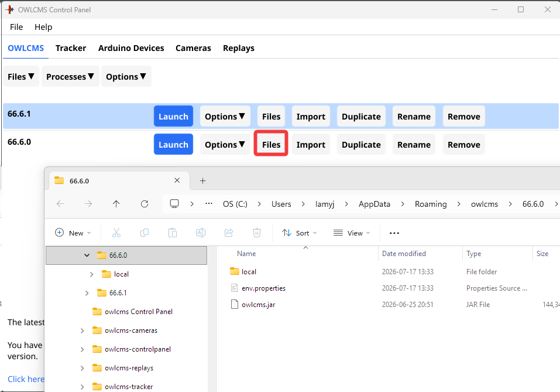

The most common option for using owlcms is to run it locally at the competition site, on a laptop.  The **owlcms Control Panel** is the only software you need to install.  It is easy to use and handles all the steps for running and updating.

> IMPORTANT: You only need **one** OWLCMS for a competition, even if the competition has multiple platforms.   So for typical use **only one control panel** is installed, **on the main competition laptop**.
> Only advanced scenarios like automatic jury replays, or using home-built MQTT buttons use more than one.

## Using the Control Panel

The control panel works the same on all the platforms (Windows, Mac, Raspberry Pi, Linux).  At a competition, only one laptop runs the control panel and owlcms.  **To install the control panel for your computer, see the [Control Panel Installation page](LocalDownloads).**

After starting the control panel, you can start and stop owlcms. To start it, use the Launch button

The control panel will then show progress information and display a button to stop the program when the competition is over.

After 15 to 30 seconds depending on your computer, a browser will show the owlcms home page.  **The address shown on the home page is important: *it is the address that all the displays and technical official browsers need to use to reach owlcms*.**

## Updating owlcms

owlcms is updated frequently for new features and bug fixes.  If you don't have the latest version, the control panel will tell you and give you an easy way to update, simply by clicking a button.

You have two choices

- The **Update** button will download the new version and add it. Both version will be show, so you don't lose the current one and can keep it until you are satisfied the new one works. "Update" will copy your current database to the new version.  Changes that you may have made to local configuration files (templates, style sheets, age groups etc.) will also be copied.

- The update does not touch the prior version, so you can always go back

- If you prefer, you can just add the new version as a clean install. There is then an import button that allows you to pick a prior version from which you can grab changes.

- To have full control over what is copied from another version, you can copy the database, custom templates, or CSS styling files yourself.  You can use the Files button to go to a given version.

## Menus

The menu bar for OWLCMS gives access to the following options

- **Files**
  In order of likelihood of usage
  - **Open Installation Directory**: You would use this to go inside of the installed versions, for example to gather log files at the request of the application maintainers.
  - **Install OWLCMS version from zip**: Your federation makes available a kit with their customized templates and database
  - **Save installed OWLCMS as zip**:  Your setup will be copied as a zip so you can give it to someone else
  - **Refresh Available Versions**: Go look at the server to see if something new is available.
  - **Uninstall OWLCMS**
- **Processes**
  - **Kill Already Running Process**  You may inadvertently start two control panels, and try to start two instances of OWLCMS.  The Control Panel will only allow one at a time.  This is used to kill a previously started version.  Sometimes there may be false warnings about a program that was actually killed, this will clear the warning.
- **Options**
  - **Enable/Disable connection to local tracker**: Tracker is an optional module.  When started from the control panel, it is typically used to display team scoreboards in team league competitions, or to produce fancy documents.  Use this option to have owlcms connect directly to tracker without having the change the parameters in the database.

There is also a top-level menu to the control panel, to manage the installed prerequisite software and exit the program.

