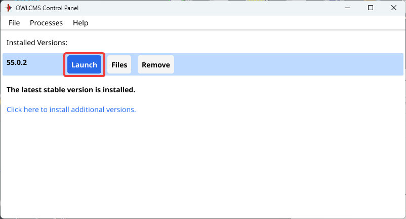

The most common option for using owlcms is to run it locally at the competition site, on a laptop.  The **owlcms Control Panel** is the only software you need to install.  It is easy to use and handles all the steps for running and updating.

## Using the Control Panel

The control panel works the same on all the platforms (Windows, Mac, Raspberry Pi, Linux).  At a competition, only one laptop runs the control panel and owlcms.  **To install the control panel for your computer, see the [Control Panel Installation page](LocalDownloads).**

After starting the control panel, you can start and stop owlcms. To start it, use the Launch button

The control panel will then show progress information and display a button to stop the program when done.

After 15 to 30 seconds depending on your computer, a browser will show the owlcms home page.  **The address shown on the home page is important: *it is the address that all the displays and technical official browsers need to use to reach owlcms*.**

After launching, the control panel shows a "Stop" button that you can use when the competition is over.  

> **You should leave the control panel open (hide it behind the other windows or minimize it).  Closing the control panel when owlcms is running is the same as clicking the "Stop" button.**

## Updating owlcms

owlcms is updated frequently for new features and bug fixes.  If you don't have the latest version, the control panel will tell you and give you an easy way to update, simply by clicking a button.

You have two choices

- The **Update** button will download the new version and add it. Both version will be show, so you don't lose the current one and can keep it until you are satisfied the new one works. "Update" will copy your current database to the new version.  Changes that you may have made to local configuration files (templates, style sheets, age groups etc.) will also be copied.

- If you prefer, you can just add the new version as a clean install.  After that is done, you can use the an `Import` button to copy the database and local file changes from another version (same as what Update does).

- To have full control over what is copied from another version, you can copy the database and files yourself. To do so, open the OWLCMS intstallation directory, and you will see all the versions.

## Menus

The menu bar for OWLCMS gives access to the following options

- **Files**
  In order of likelihood of usage
  - **Open Installation Directory**: You would use this to go inside of the installed versions, for example to gather log files at the request of the application maintainers.
  - **Install OWLCMS version from zip**: Your federation makes available a kit with their customized templates and database
  - **Save installed OWLCMS as zip**:  Your setup will be copied as a zip so you can give it to someone else
  - **Refresh Available Versions**: Go look at the server to see if something new is available.
  - **Uninstall OWLCMS**
- **Processes**
  - **Kill Already Running Process**  You may inadvertently start two control panels, and try to start two instances of OWLCMS.  The Control Panel will only allow one at a time.  This is used to kill a previously started version.  Sometimes there may be false warnings about a program that was actually killed, this will clear the warning.
- **Options**
  - **Enable/Disable connection to local tracker**: Tracker is an optional module.  When started from the control panel, it is typically used to display team scoreboards in team league competitions, or to produce fancy documents.  Use this option to have owlcms connect directly to tracker without having the change the parameters in the database.

There is also a top-level menu to the control panel, to manage the installed prerequisite software and exit the program.

## Technical Overview

In a typical local setup, a laptop is used as the *main computer*. It can be any reasonable laptop. Often the announcer or marshal computer is used. The control panel is installed on the computer chosen as main computer. 

The control starts and stops the owlcms program.  All the other displays and devices talk to owlcms on the main laptop over the network (WIFI or Ethernet).  

- owlcms runs on a single computer, no matter how many platforms are in use. This is the main computer.  When there are multiple platforms, the main laptop is often dedicated to owlcms instead of being used by an announcer.
- The control panel is installed on the main computer to start/stop owlcms.
- All the other displays connect to the main computer using the HTTP address shown on the initial browser.
- Phones or tablets also connect using HTTP using their web browser.
