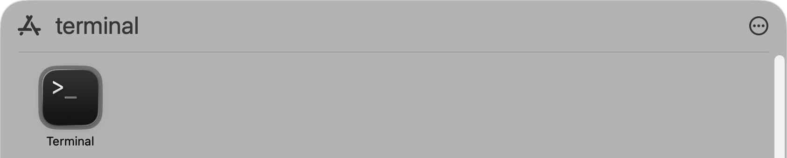
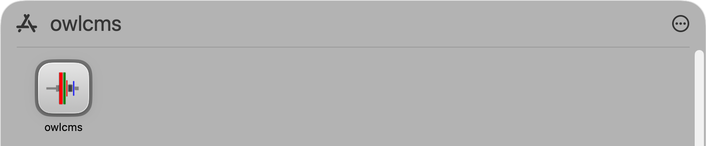

## macOS Installation using `brew`

> The OWLCMS control panel can also be installed using the widely-used `brew` command.

#### 1. Install the setup tool

This step is not needed if you already have `brew` installed.

- Move your mouse over the grey box below, then click the **Copy to Clipboard** text that appears in its top-right corner (it will say "Copied").

  ```
  /bin/bash -c "$(curl -fsSL https://raw.githubusercontent.com/Homebrew/install/HEAD/install.sh)"
  ```

- Using the Application icon   at the bottom of your screen in  the Dock, 

  1. Type `Terminal` to locate the Terminal application. You should see something like this.

  

  2. Start **Terminal** by clicking once on the icon
  3. **Paste** the command that we copied earlier using `⌘V` (Command-V) and then type `↩` (Return) to start it.
  4. You will be asked for your password
     -  Type your password for your Mac. *Nothing will appear as you type — no letters, no dots, no stars.*
     -  Hit  `↩`  (Return) at the end of your password
  5. You will need to hit Return again and accept suggestions by typing `yes` or `y`  as requested
     - Don't worry about lots of text being printed out
     - You can ignore the suggested list of Next Steps that is printed when the installation finishes, unless you really want to have `brew` on your PATH

#### 2. Install the OWLCMS Control Panel

- After the setup tool is installed, you are back to a waiting terminal.
  
- If you have a newer Apple Silicon Mac (M1/M2/M3...) , move your mouse over the grey box below, then click the **Copy to Clipboard** text that appears in its top-right corner (it will say "Copied").
  
  ```
  /opt/homebrew/bin/brew install --cask owlcms/brew/controlpanel --force
  ```
  
  Go back to the terminal window, **Paste** and hit **Return** `↩` to run the command.
  
- For an older Intel Mac, move your mouse over the grey box below, then click the **Copy to Clipboard** text that appears in its top-right corner (it will say "Copied").

  ```
  /usr/local/bin/brew install --cask owlcms/brew/controlpanel --force
  ```

- After the installation runs, OWLCMS control panel will be visible as owlcms in the Applications folder
  

- Clicking on the icon will now start the control panel.  The control panel will offer to finish the installation by retrieving the latest version of the actual scoring system.

#### 3. Installing a Specific Version

You can install a specific version by adding it  to the cask name, for example `--cask owlcms/brew/controlpanel@3.5.0-rc05`.  The special cask name `owlcms/brew/controlpanel-prerelease` is the latest prerelease.

#### 4. Future Updates

If in the future you are asked to update the control panel, you can use these commands.

- If you have a newer Apple Silicon (M1/M2/M3...) Mac, copy and paste the following to the terminal window 

  ```
  /opt/homebrew/bin/brew update 
  /opt/homebrew/bin/brew upgrade --cask owlcms/brew/controlpanel
  ```

  For an older Intel Mac, the command is

  ```
  /opt/homebrew/bin/brew upgrade 
  /usr/local/bin/brew upgrade --cask owlcms/brew/controlpanel
  ```
