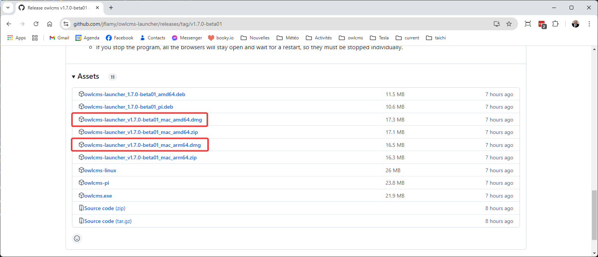

## macOS Installation

### Installation

- Go to the page https://github.com/jflamy/owlcms-launcher/releases.  **Scroll down to the Assets section**.
  
  - If you have a **newer M1/M2/M3/M4 mac**, get the installation package that ends with **`_arm64.dmg`**.
  
  - If you have an **older Intel mac**, get instead the installation package that ends with **`_amd64.dmg`.**
  
  
  
  
- Download the .dmg file to your computer

- Open the .dmg file. Drag the owlcms icon over the Applications icon

### Running OWLCMS

- **Right-click on the owlcms icon and use Open** to authorize the application to run.  This is only needed the first time around.

- Once this is done, you can follow the steps shown in the [Local Control Panel Overview](LocalControlPanel)

