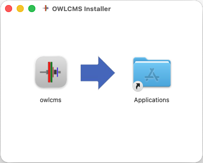
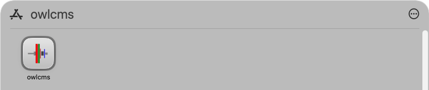
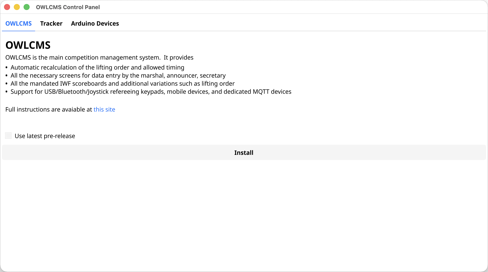
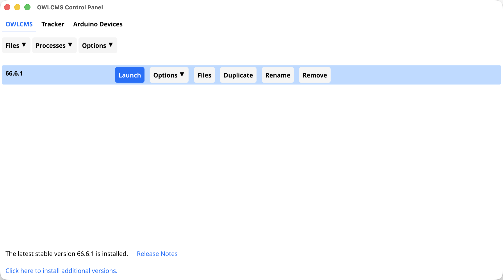

## macOS Installation

This is a typical macOS installation process.  If you prefer command-line installs using `brew`, see [this page](LocalMacBrewSetup).

- Download the `.dmg` installer from the [release repository](https://github.com/owlcms/owlcms-controlpanel/releases) 
  - For current AppleSilicon Macs (M1/M2/M3...) use this link:  [macOS Installer](https://github.com/owlcms/owlcms-controlpanel/releases/latest/download/macOS_OWLMCS.dmg)
  - For older Intel Macs: use this link: [macOS **Intel** Installer](https://github.com/owlcms/owlcms-controlpanel/releases/latest/download/macOS_Intel_OWLMCS.dmg)
- Open the `.dmg` file.   You should see something like this
  
- Drag the owlcms icon over the Application icon.  This will copy the OWLCMS Control Panel to your Applications folder.

### Starting OWLCMS

- Open the Applications folder using the  Dock icon at the bottom of your screen. 
- Type "owlcms"  and click on the icon.
  

- The control panel will now open. On first use, the control panel will offer to complete the installation by retrieving the current version of the scoring system. 
  

- After the `Install` OWLCMS will be ready for use using the `Launch` button.  See the [Control Panel](LocalControlPanel) page for more information.
  
