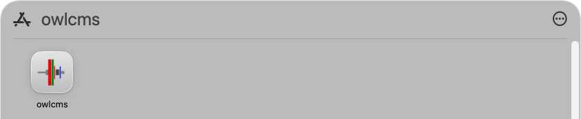

## macOS Installation 

> The OWLCMS control panel is installed using a widely used setup tool that also handles automatic updates.  You will be asked to run two (2) commands and to type your password once.

#### 1. Install the setup tool

- Move your mouse over the grey box below, then click the **Copy to Clipboard** text that appears in its top-right corner (it will say "Copied").

  ```
  /bin/bash -c "$(curl -fsSL https://raw.githubusercontent.com/Homebrew/install/HEAD/install.sh)"
  ```

- Using the Application icon   at the bottom of your screen in  the Dock, 

  1. Type `Terminal` to locate the Terminal application. You should see something like this.

  

  2. Start **Terminal** by clicking once on the icon
  3. **Paste** the command that we copied earlier using `⌘V` (Command-V) and then type `↩` (Return) to start it.
  4. You will be asked for your password
     -  Type your password for your Mac. *Nothing will appear as you type — no letters, no dots, no stars.*
     -  Hit  `↩`  (Return) at the end of your password
  5. You will need to hit Return again and accept suggestions by typing `yes` or `y`  as requested
     - Don't worry about lots of text being printed out
     - **Ignore** the suggested list of Next Steps that is printed when the installation finishes. 

#### 2. Install the OWLCMS Control Panel

- After the setup tool is installed, you are back to a waiting terminal.
  
- If you have a newer Apple Silicon Mac (M1/M2/M3...) , move your mouse over the grey box below, then click the **Copy to Clipboard** text that appears in its top-right corner (it will say "Copied").
  
  ```
  /opt/homebrew/bin/brew install --cask owlcms/brew/controlpanel --force
  ```
  
  Go back to the terminal window, **Paste** and hit **Return** `↩` to run the command.
  
- For an older Intel Mac, move your mouse over the grey box below, then click the **Copy to Clipboard** text that appears in its top-right corner (it will say "Copied").

  ```
  /usr/local/bin/brew install --cask owlcms/brew/controlpanel --force
  ```

- After the installation runs, OWLCMS control panel will be visible as owlcms in the Applications folder
  

- Clicking on the icon will now start the control panel. 

 **We are done.**

#### 3. Future Updates

If you are later asked to update the control panel, see [this page](LocalMacSetupBrewUpdate.md)
