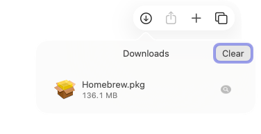
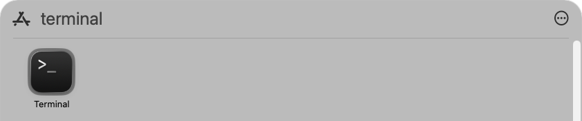
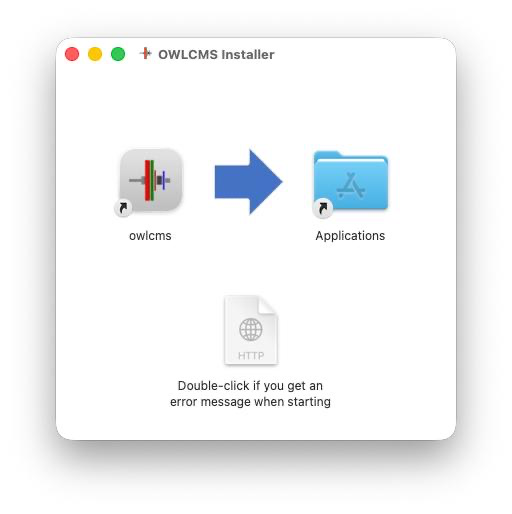
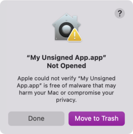
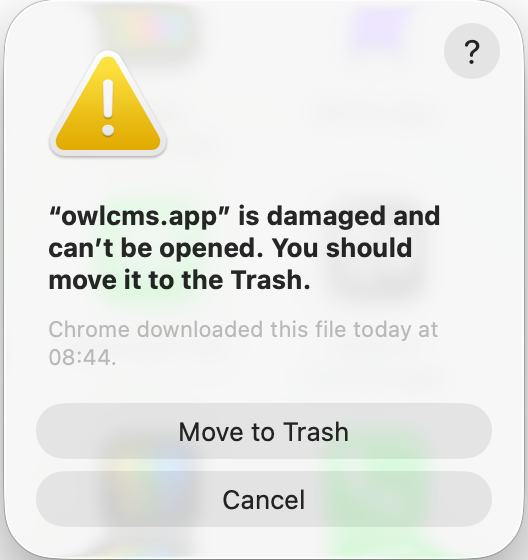

## macOS Installation 

macOS is opinionated about software that has not gone through the notarization process and it generates needlessly alarming warnings, even when updating (see the [legacy installation](LocalMacSetupLegacy.md) for examples)

The process described below gets around those issues.

#### 1. (Needed only once) Install the `brew` Application Manager

This is not needed if you already use `brew`.

Click on the link to download [**this file**](https://github.com/Homebrew/brew/releases/latest/download/Homebrew.pkg).   Allow downloading if asked.

- If using Safari, you will see something like this if you click on the down arrow icon at the top right of the browser. (Similar icons are present on Chrome and Firefox)

  

- Double click on the image. This will open an installer.  
  

-  Click on **Continue** and accept all the proposed defaults.

  - You will be asked for your passoword or TouchId.
  - At the end of the process (when the **Close** button is shown, a confusing text is shown. ***Blissfully ignore it.*** 
  - When asked to move the .pkg installer to trash, you can accept.

#### 2. Install the control panel

- Using the Application icon   in the Dock, type `Terminal` to locate the Terminal application. Start it by clicking on the icon.
  

- If you have a newer Apple Silicon Mac (M1/M2/M3...) , copy and paste the following to the terminal window (move your mouse over the text and click on the box at the top right to copy)
  ```
  /opt/homebrew/bin/brew install --cask owlcms/brew/controlpanel
  ```

  For an older Intel Mac, the command is
  ```
  /usr/local/bin/brew install --cask owlcms/brew/controlpanel
  ```

- The OWLCMS control panel will then be visible as owlcms in the Applications folder

  

#### 3. Upgrading the control panel to the current version

- If you have a newer Apple Silicon (M1/M2/M3...) Mac, copy and paste the following to the terminal window 

  ```
  /opt/homebrew/bin/brew update 
  /opt/homebrew/bin/brew upgrade --cask owlcms/brew/controlpanel
  ```

  For an older Intel Mac, the command is

  ```
  /opt/homebrew/bin/brew upgrade 
  /usr/local/bin/brew upgrade --cask owlcms/brew/controlpanel
  ```


## macOS Installation - Legacy

This is the "traditional" installation process that unfortunately produces warnings and requires going to the settings directory to get around them.  You don't need this if you installed brew, but it will work if you prefer this method.

- Download the `.dmg` installer from the [release repository](https://github.com/owlcms/owlcms-controlpanel/releases) 
  - For current M1/M2/M3/M4/M5... AppleSilicon Macs: use this link [macOS Installer](https://github.com/owlcms/owlcms-controlpanel/releases/latest/download/macOS_OWLMCS.dmg)
  - For older Intel Macs: use this link: [macOS **Intel** Installer](https://github.com/owlcms/owlcms-controlpanel/releases/latest/download/macOS_Intel_OWLMCS.dmg)

- See this link for the [release notes](https://github.com/owlcms/owlcms-controlpanel/releases/latest)
- Open the `.dmg` file.   You should see something like this
  
- Drag the owlcms icon over the Application icon.  This will copy the control panel app in your Application folder and you will find it there along with your other applications

## Starting the OWLCMS Control Panel

Open the Application folder using the  Dock icon and double-click on the owlcms icon.

> When you run the application for the first time after the initial installation, or after updating, **macOS will prevent it from running**.  Donations to acquire the necessary certificates to notarize the application and remove the need for the workarounds will be accepted, contact the developer at [owlcms@jflamy.dev]() 
>
> There are two distinct situations.

## 1. Fixing "Start Denied after Initial Installation"

When you first install the application and attempt to launch it, you will see something like 



There are two remediesns for this

- **For Current macOS**
  
  - Go to the  `System Settings` > `Privacy` menu.  Scroll to the bottom.  You should see an option to allow owlcms to run.  See this [illustrated guide](https://wiki.hacks.guide/wiki/Open_unsigned_applications_on_macOS_Sequoia) for the process -- you will of course use `owlcms` as the application name.
  
- **For macOS 14 and earlier**:
  - Instead of double-clicking to start the application, **Right-click** on it. A warning about running an unsigned application will come up. **Select Open** to authorize the application to run.  This is only needed the first time around.

  Once this is done, you can follow the steps shown in the [Local Control Panel Overview](LocalControlPanel)

## 2. Fixing "Start Denied after an Update"

If you later download an updated DMG file and execute it, you will be prompted to replace or keep the existing app. Use "Replace".   When you launch the program, you will likely get a denial like this.



The reason is that macOS memorized a fingerprint for the version you initially accepted, but the new version does not match.  The program is then put in "quarantine". The fix is as follows

1. Open the Terminal application

2. Type the following (or move your cursor on the text, copy to clipboard, right-click to paste in Terminal, then ⏎ Return )

   ```
   xattr -rc /Applications/owlcms.app
   ```

3. Start owlcms again

