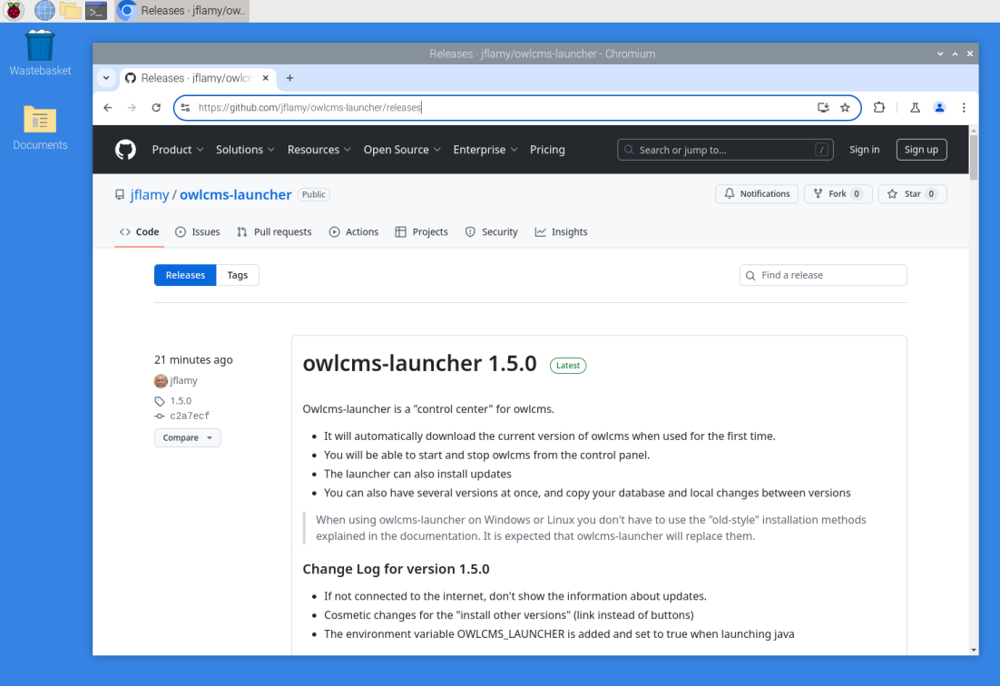
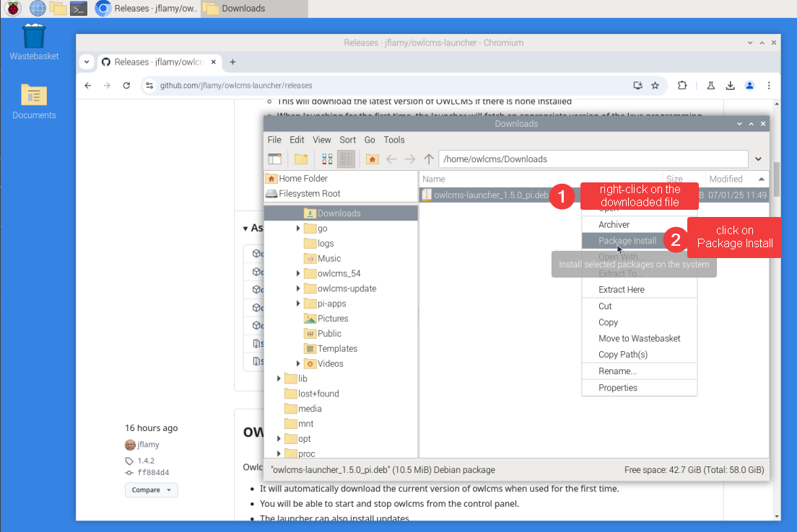
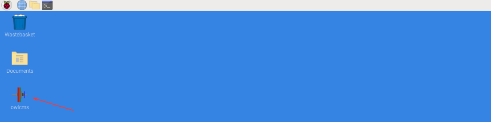
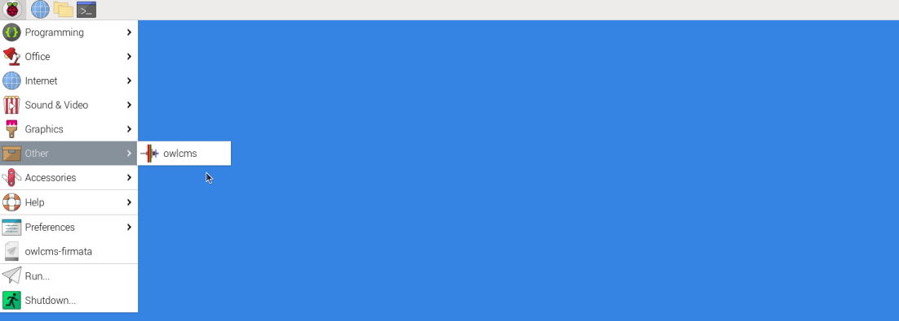
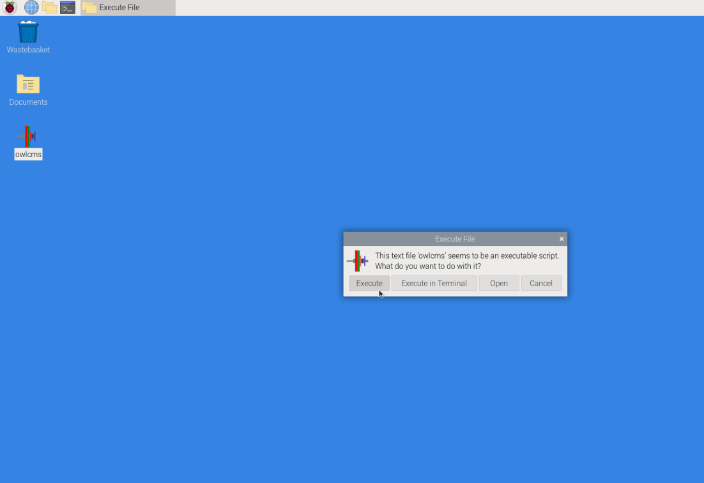

## Raspberry Pi or Linux Installation

### Installation

- Go to the page https://github.com/jflamy/owlcms-launcher/releases.
  

- **Scroll down and download the installation package by clicking on the file that ends with`pi.deb`.** 
  If you are installing on Intel Linux, use amd64.deb instead

  

- **Move your mouse to the right of the download notification.  You should see a folder appear, click on it.**  
  If you don't see it you can use the "..." menu and scroll down to "Downloads" to open the list of downloaded files,  and then there is also a small folder icon.

  

- Once you see the file, **Right-click on the file name** and then **select Package Install**

  

- Accept the Install prompt

  

- To install the launcher you need to type the password to your pi account.

  

- The package will then install, and create a desktop icon, as well as an entry in the "Other" menu.

  

  

### Running OWLCMS

- If you double-click the desktop icon, you will be asked what to do; select "Execute".
  If you use the Other > owlcms menu entry there is no confirmation required.

- Once this is done, you can follow the steps shown in the [Local Control Panel Overview](LocalControlPanel)

