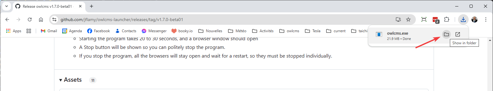

## Windows Installation

### Installation

- Go to the page https://github.com/jflamy/owlcms-launcher/releases.
  

- **Scroll down and download owlcms.exe`.** 
  You may get warnings about an insecure file from an unknown author.  Select "Keep" repeatedly until the file downloads.

  

- **Move your mouse to the right of the download notification.  You should see a folder appear, click on it.**  
  If you don't see it you can use the "..." menu and scroll down to "Downloads" to open the list of downloaded files, and then there is also a small folder icon.

  

- This will show you the directory with all downloads.  **Move the file to your Desktop by dragging it, or using copy/paste**

  

### Running OWLCMS

- The owlcms launcher will now be visible on your desktop. **Double-click on the file**.

  - The current version of OWLCMS will be downloaded automatically.

  

- **Click on the Launch button**

  - The first time you use Launch, the correct version of the Java language environment will be downloaded

  

- The launcher starts OWLCMS.  While OWLCMS is getting ready, a blank browser page is opened. 
  **Once the browser page is loaded, everything is ready.**

  - On a Windows machine, the startup can take up to 30 seconds.

  

  > IMPORTANT: 
  >
  > - **Leave the OWLCMS launcher window open** (or minimize it if you want).  
  >   - If you close the windows or use the Stop button, then OWLCMS will stop for all users.
  >   - If you stop OWLCMS by mistake, you can just launch it again.  All the browsers on all the laptops will notice OWLCMS is back and will reload automatically.
  > - We suggest you also leave the browser open because it shows the addresses you need to use on the other computers.
  >   - When opening other laptops, you will use the "wired" address shown on the browser (localhost:8080 only works on the computer where you ran the launcher)
  >   - If you close the browser, reopen it using the address https://localhost:8080  This address only works on the computer where you started OWLCMS, and is the easiest way to get the address to use on the other computers.

### Updating OWLMCS

When starting the launcher, if you are connected to the Internet, it will try to fetch the available versions.  If you do not have the latest version installed, you will told, and given the option to update.  If you are at a competition site without internet access, the update check will obviously fail and there will be no update information.

Updating will copy your existing database as well as changes you may have made to your `local` folder since installing.

> IMPORTANT: As a precaution, if there is important data in your current database, you should always export it before updating. To do so, launch the current version, go to the Prepare Competition page, and use the Export button near the bottom.  Then use the launcher to update.

