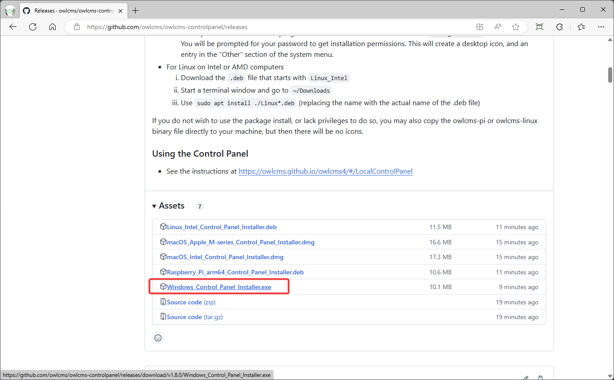

## Windows Installation

### Installation

- Go to the page https://github.com/jflamy/owlcms-launcher/releases.
  
- **Scroll down and download owlcms.exe.** 
  You may get warnings about a file not downloaded often or potentially insecure.  Select the "Keep" options repeatedly until the file downloads.

  

- Once the file downloads, **Move your mouse to the right of the download notification.  You should see a folder appear, click on it.**  
  You may need to click on the Download down arrow on the menu.
  You can also use the "..." menu and scroll down to "Downloads" to open the list of downloaded files, you will then find the small folder icon next to the file name.
  
  
  
- This will show you the directory with all downloads.  **Move the file to your Desktop by dragging it, or using copy/paste**

  

### Running OWLCMS

- The owlcms launcher will now be visible on your desktop. **Double-click on the file**.

  - The first time you run the file, it is likely that Windows will complain. **Click on More Info** and then, click on **Run Anyway**

  

- Once this is done, you can follow the steps shown in the [Local Control Panel Overview](LocalControlPanel)
