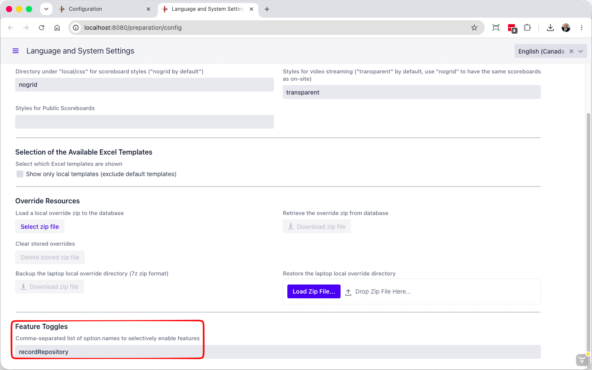
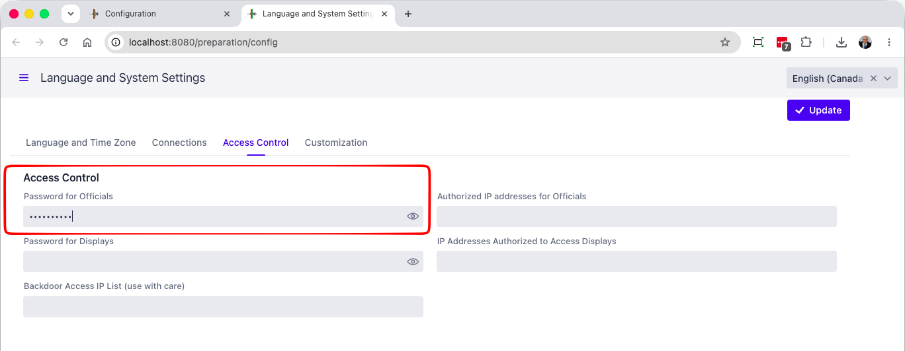
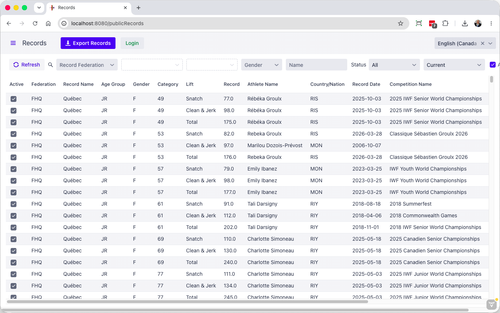
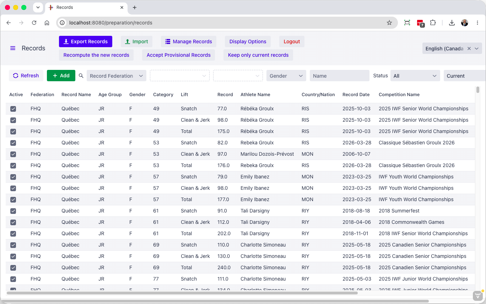
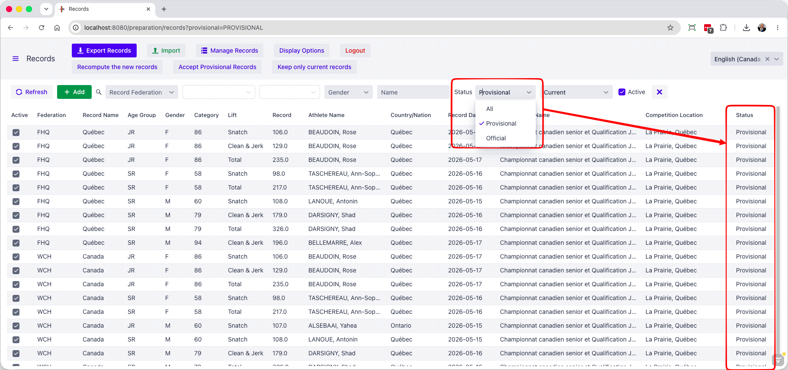
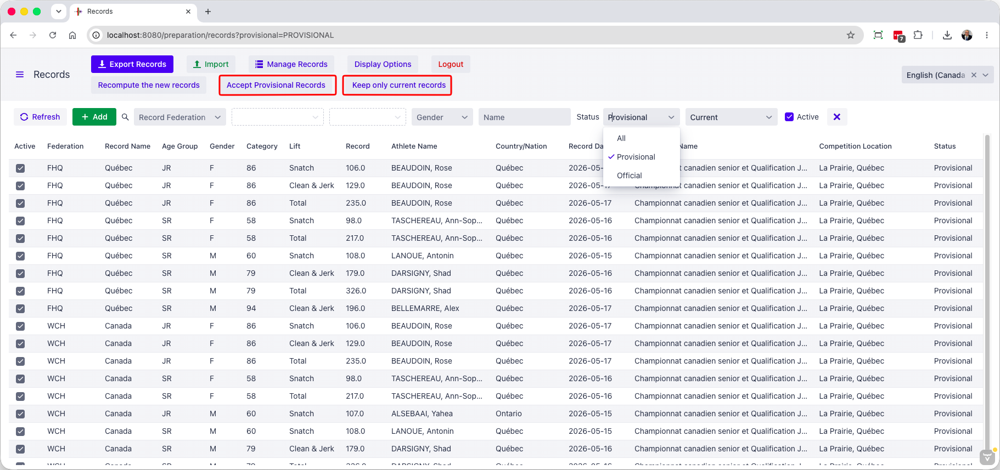
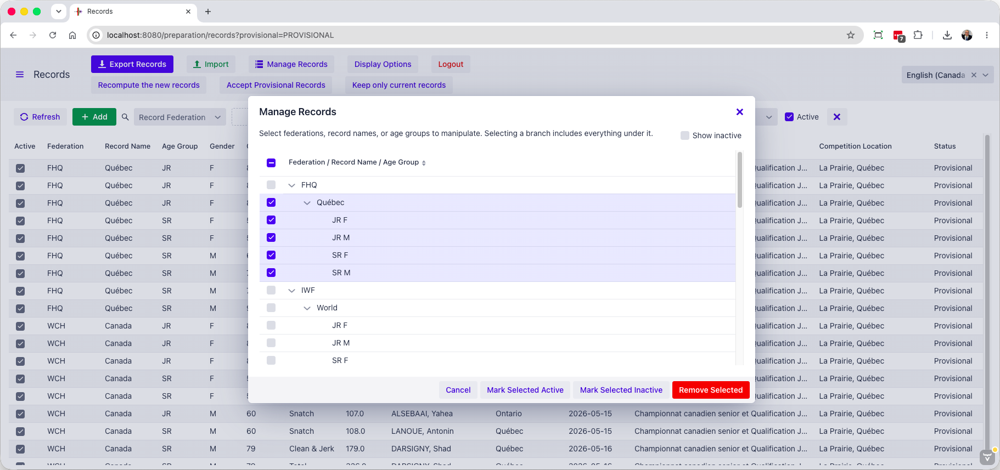

## Record Repository

A Record Repository is a separate installation of OWLCMS that has a special setting that turns it into a records database.

This allows a federation to have an easy to use way to keep, update and publish its records.

### Setup

In order to run OWLCMS in record repository mode, you need to 2 things:

1. Set a password on the Access Control page of the systems settings
2. set the `recordRepository` Feature Toggle on the system settings Customization page

You should also set a password if the repository is on a cloud setup

## Public Access

After setting a password and enabling the toggle, the default page for the site is a read-only view of the records table.

Users can filter the records they need, and export them in Excel data interchange format to load in OWLCMS, or in display format as a basis for publishing them.

## Editing Access

In order to edit records, the green Login button is used. The user is then asked to enter the password if one is set. This enables the full capabilities

## Importing New Records From A Competition 

The repository will often be used to import new Provisional records from a competition.  To do so, simply use the import button, with the file produced while exporting the provisional records from the competition. (see [Exporting New Records](2500RecordsManagement#exporting-new-records))

## Accepting New Records

To accept the new records

1. Clear all filters, or filter down to the subset where you want to accept the provisional records
2. Accept Provisional Records -- this will make them Official
3. If you don't wish to keep a full historical trace, use the Keep ony the current records

### Managing the Repository

Finally, using the Manage Records at the top, you can remove records, or hide them (make them inactive). Inactive records are useful to keep historical records that were set with different categories.

It is often simpler, conceptually, to delete records prior to importing new files.  You are strongly encouraged to make backups if you use this approach 

