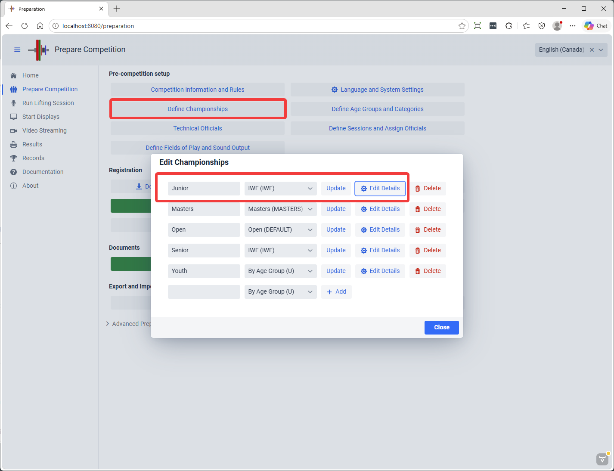
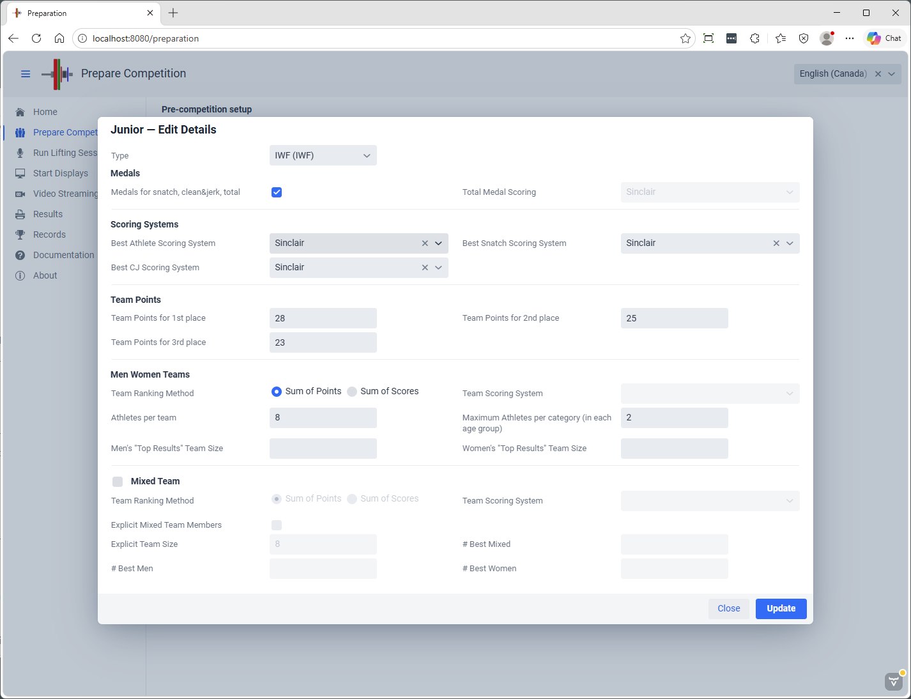
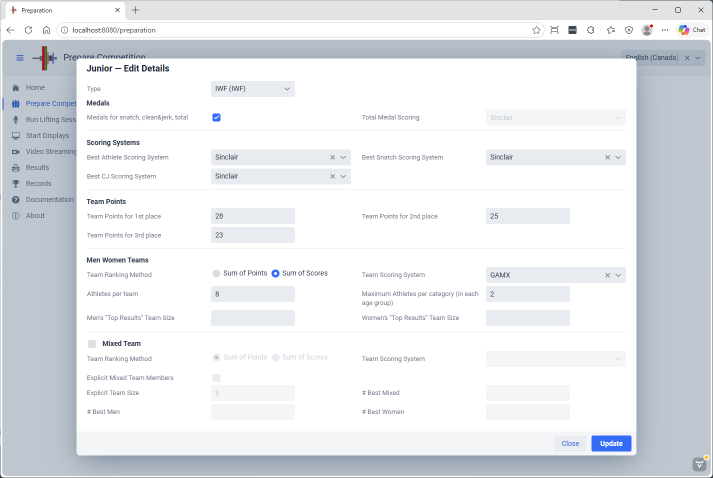
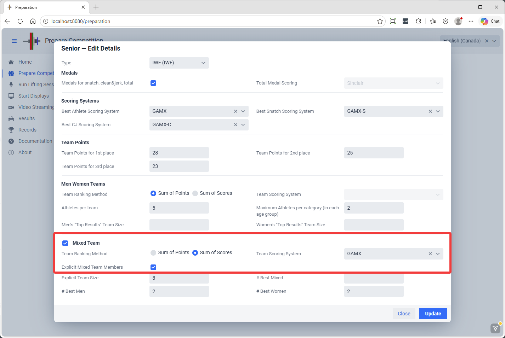
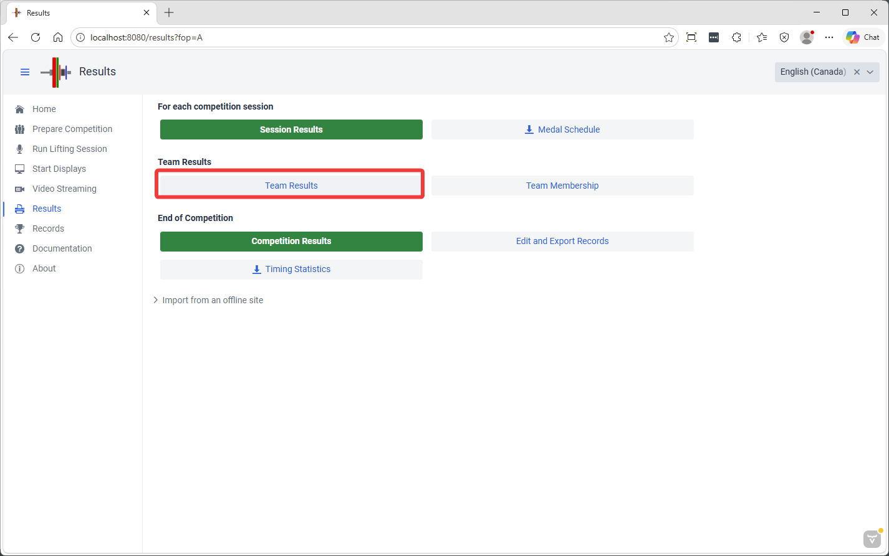
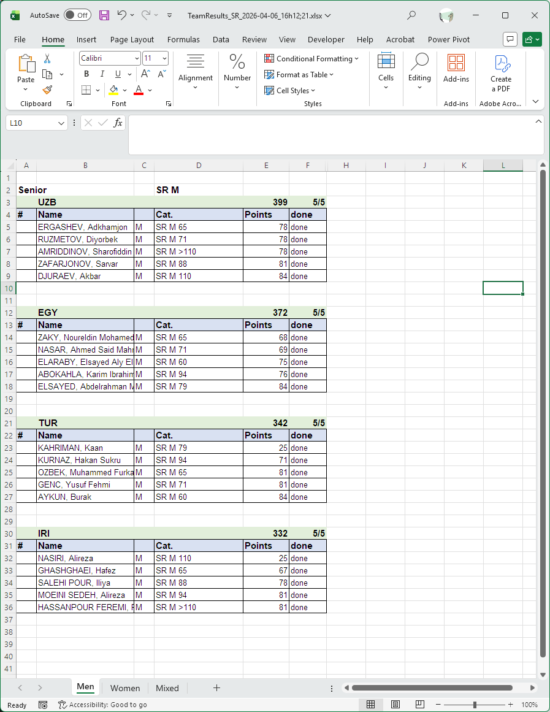

## Team Championships

OWLCMS supports the creation of teams.  Each championship can have a Men, a Women and a Mixed team. To define the team rules, use the Define Championships button on the Prepare Competitions page.  

In this first example, we are defining a traditional Junior Championship

### Standard Championships

In this example,

- There are medals for total
- The best Athletes are determined using Sinclair
- Team points follow the normal IWF rules 28 25 23 then 22, 21, etc.
- Teams win according to the sum of points
- There are 8 athletes per team, maximum 2 per category.   *Team Selection is explained [Below](#team-selection)*

It would have been possible to use other rules, for example

- No matter how many athletes registered for the team take the top 3 men and top 2 women (or whatever)

### **Score Based Championships**

In the next example, instead of adding points, the winner is determined by adding the scores of the team members

### Points-based Mixed Championships

Traditionally, mixed teams championships were defined by adding the points of the men and women teams.  The example below does this

- The format selected is "sum of points"
- the "Explicit Team Members" is NOT selected, so the two men and women teams are combined

### **Score-based Mixed Championships**

There are now scoring formulas that are equitable for men and women, such that it is possible to add them together.  In this competition, the Senior championship has a mixed championship.

- "Sum of Scores"  is selected
- We also decide to select the team members explicitly instead of just combining the men and women, and the team will be a maximum of 8. 

- We could have just added the men+women teams together, and we could have decided to just pick the best n men and best n women instead of naming them in advance.  Each championship can have its 

### Team Selection

To create Explicit Teams as in traditional IWF-style competitions, or for explicit mixed teams, use the Team Membership button on the Prepare Competition page

In this example, the teams were defined to be 5 persons for the gendered teams and 8 for the mixed team

Opening each section allows selecting who is on the team or not using the checkboxes.

### Team Results

The results page has a dedicated area for team results

This shows the totals per team

And the details

A summary spreadsheet with the Men Women and Mixed results can be downloaded as well
