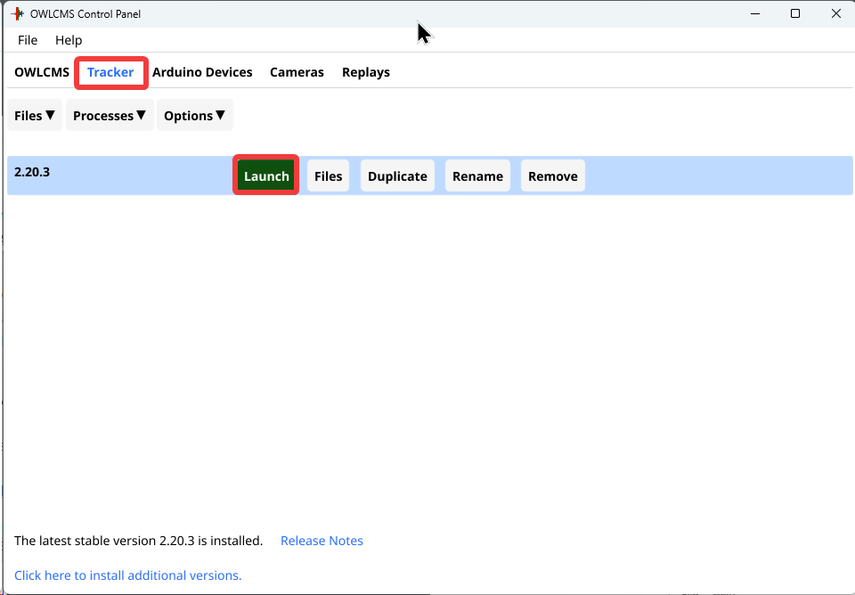
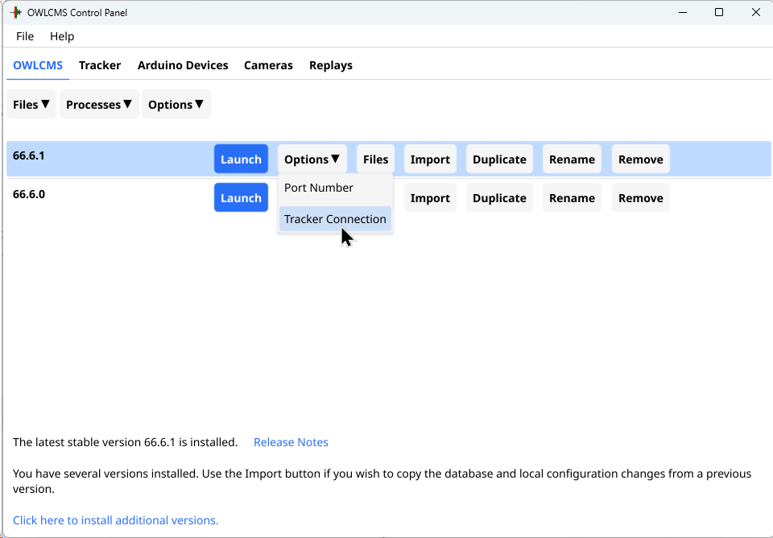
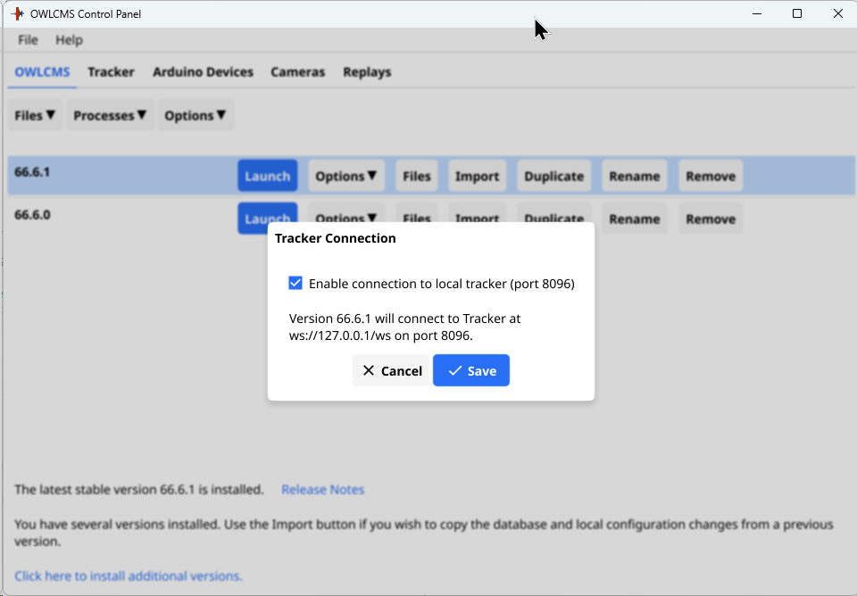
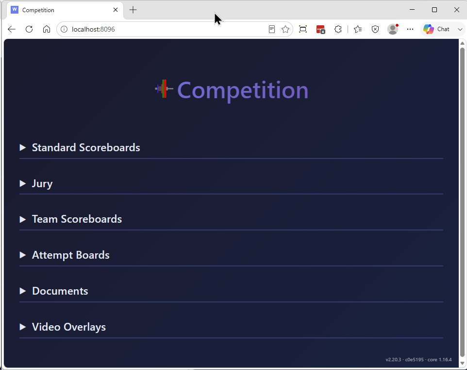

## Using the Tracker Module

The tracker module is an add-on to OWLCMS.   OWLCMS sends its database over to tracker, and then all the events of the competition so the tracker module can have an exact replica of the state of the competition. Tracker has two main modes

- When run in the cloud, anyone with an internet connection can watch the competition scoreboards
- When run locally
  - Specialized team scoreboards can be displayed for team competitions
  - Documents such as referee assignments can be created, updated live from changes made in owlcms

The other benefit of Tracker is that the source is completely open, and can be manipulated using AI agents.  This has allowed people to create several innovations for themselves

- Specialized attempt boards with additional information
- Specialized documents such as IWF-style start and result books
- Integrations with streaming software to enable automatic scene switching driven by the competition state.

### Running Tracker Locally

The easiest way to use tracker is to run it on the same machine as OWLCMS.   This is typically the case when using it for team scoreboards or for refereeing documents. 

To do so, start tracker from the control panel (the first time you use it the Tracker tab will show an install page).

Then go back to OWLCMS, and use the Option button to tell the OWLCMS version that it needs to connect to the local tracker.

Select the option.  The next time OWLCMS starts, it will connect to the local tracker.   If you're running OWLCMS on http://192.168.1.100:8080, then tracker will be reachable at http://192.168.1.100:8096  (same as OWLCMS, but different port number.)

To connect to a tracker running in the cloud, UNSELECT the local tracker connection, and configure the connection inside the OWLCMS app, on the Connexions section of the Language and System Settings page.

Once OWLMCS and Tracker see each other, they resynchronize, and the tracker page looks like the following.  Stopping either Tracker or OWLCMS will cause a re-synchronization when they restart.  If you change icons, pictures, logos, etc. in OWLCMS you should restart OWLCMS so it re-packages these files.

