## Raspberry Pi or Linux Installation

### Installation

- Go to the page https://github.com/jflamy/owlcms-launcher/releases.
  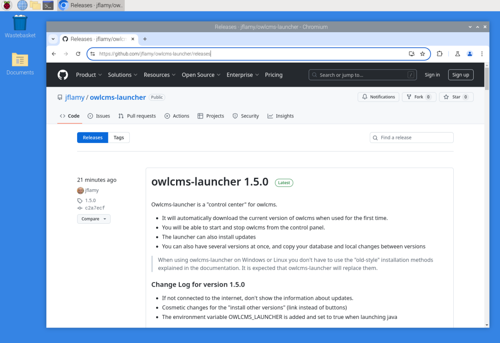

- **Scroll down and download the installation package by clicking on the file that ends with`pi.deb`.** 
  If you are installing on Linux, use amd64.deb instead

  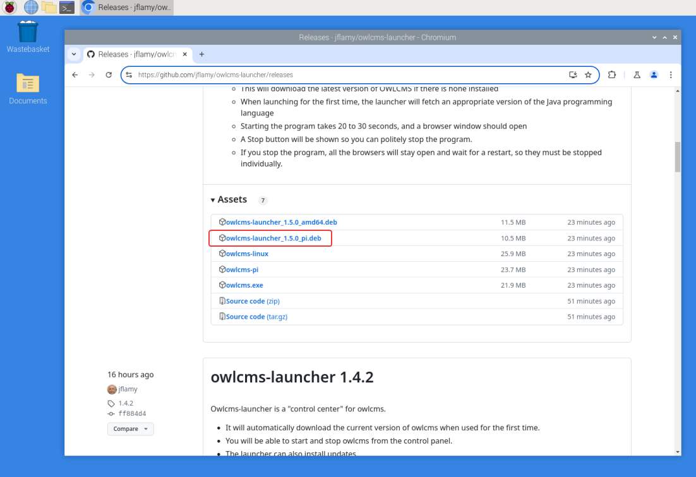

- **Move your mouse to the right of the download notification.  You should see a folder appear, click on it.**  
  If you don't see it you can use the "..." menu and scroll down to "Downloads" to open the list of downloaded files,  and then there is also a small folder icon.

  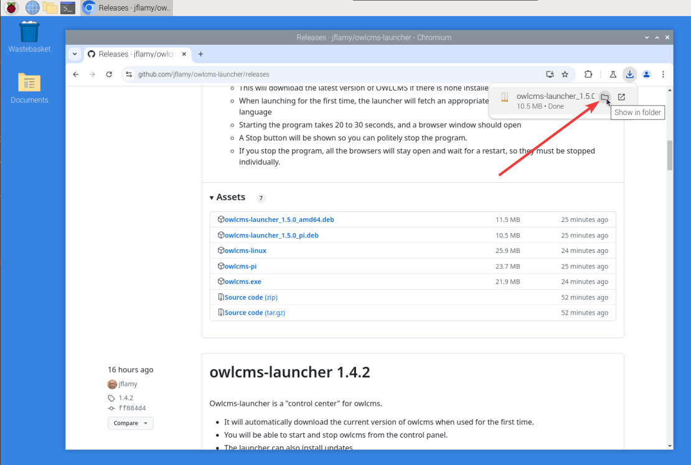

- Once you see the file, **Right-click on the file name** and then **select Package Install**

  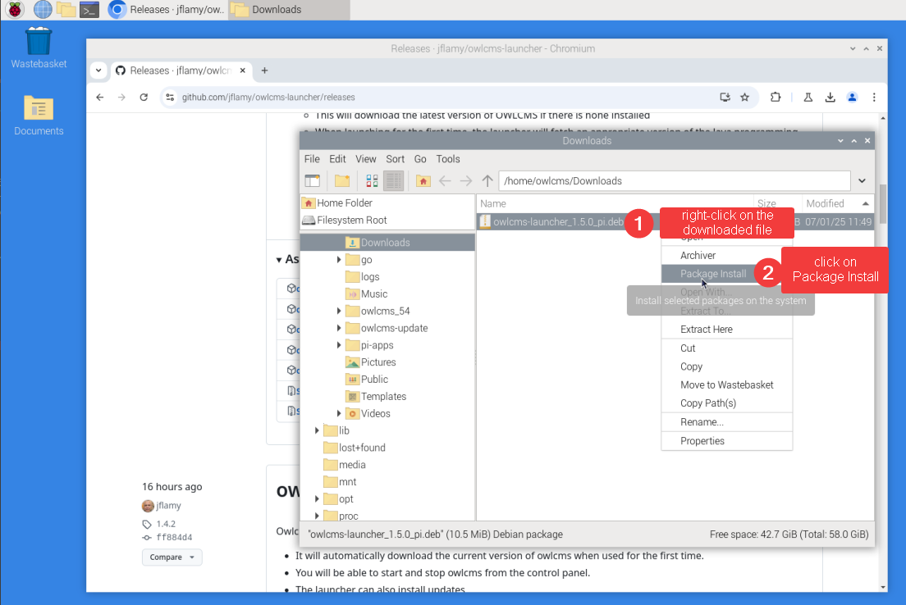

- Accept the Install prompt

  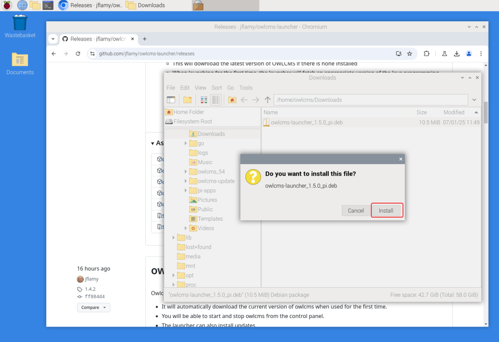

- To install the launcher you need to type the password to your pi account.

  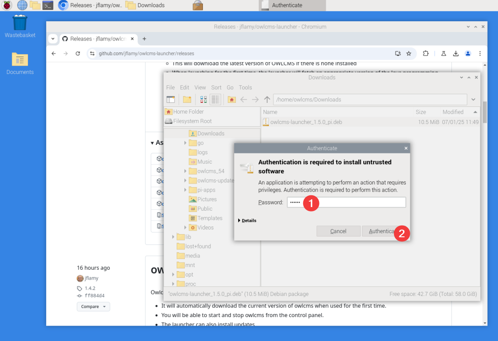

- The package will then install, and create a desktop icon, as well as an entry in the "Other" menu.

  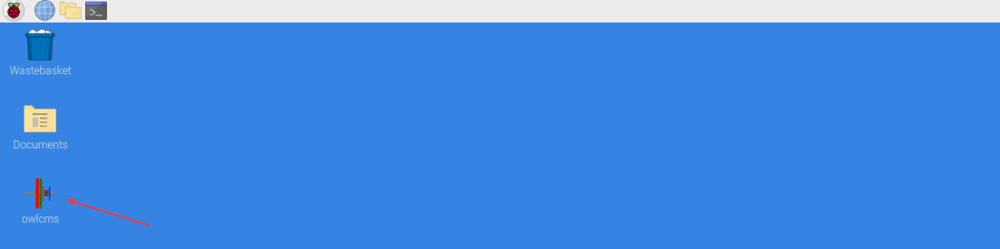

  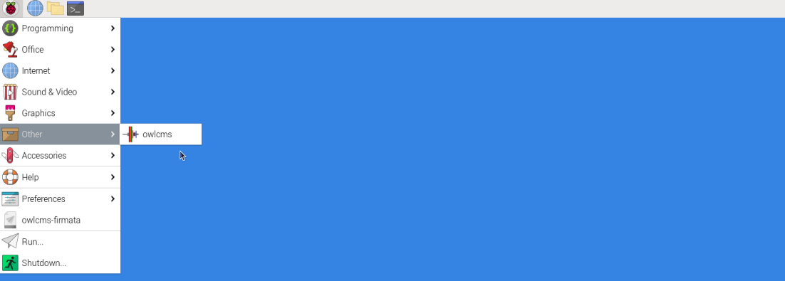

### Running OWLCMS

- If you double-click the desktop icon, you will be asked what to do; select "Execute".
  If you use the Other > owlcms menu entry there is no confirmation required.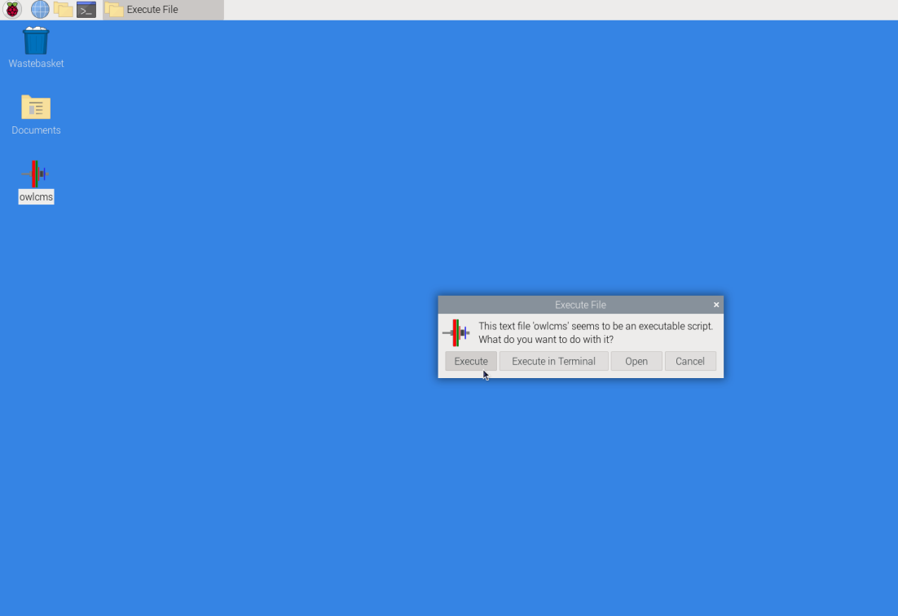

- The first time the launcher is executed, the current version of the program will be downloaded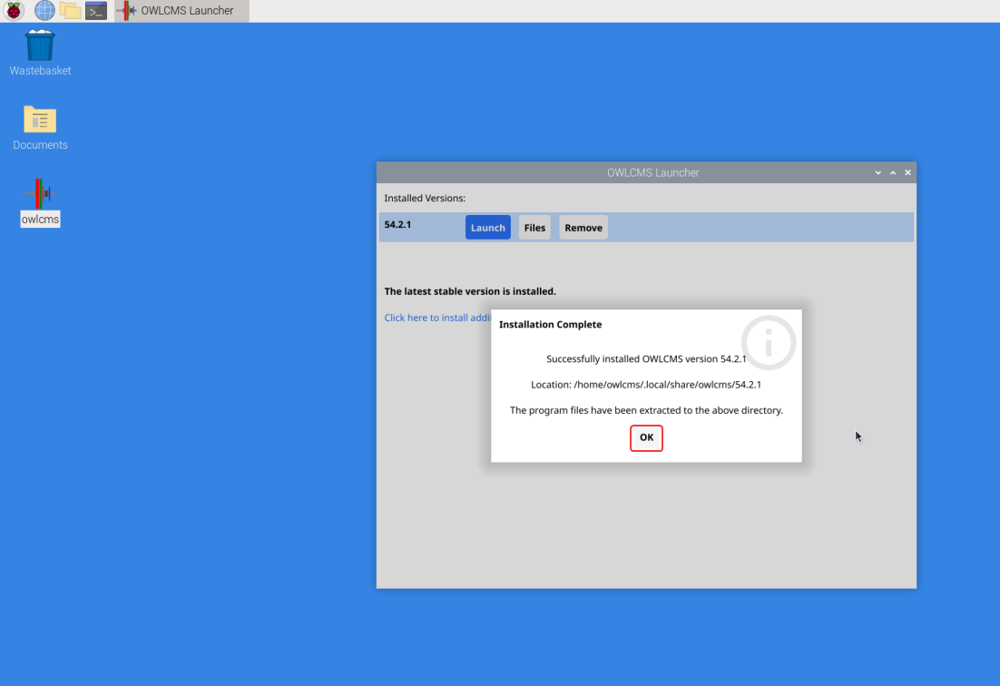

- You can then select `Launch` to start OWLCMS

  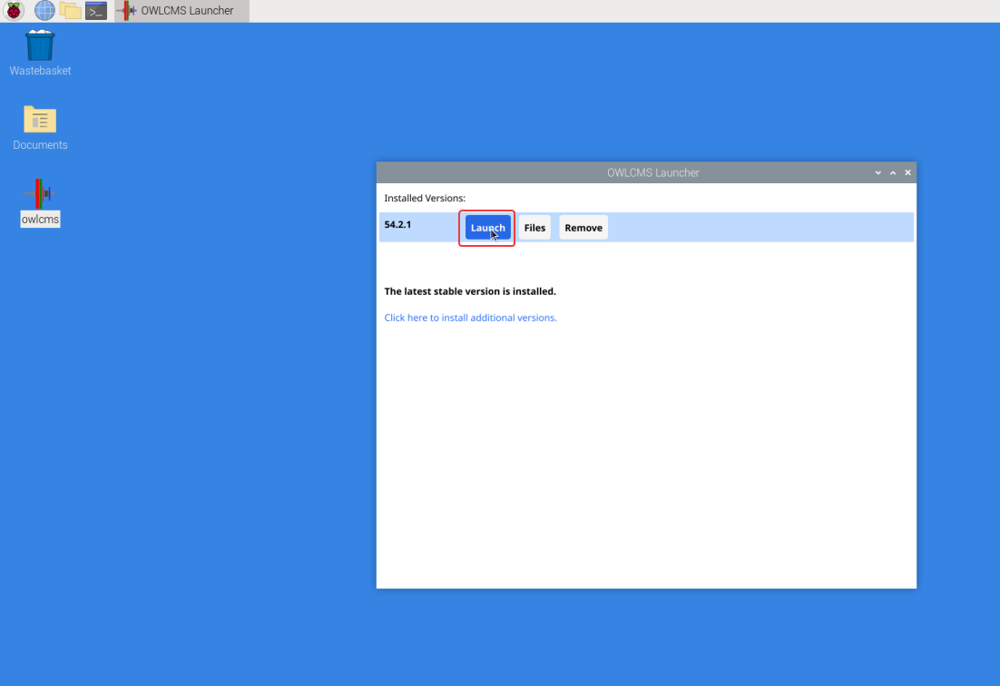

- The launcher starts OWLCMS.  During the time OWLCMS gets ready, a blank browser page is opened. Once the browser page is populated, everything is ready.

  > IMPORTANT: 
  >
  > - **Leave the OWLCMS launcher window open** or minimize it if you want.  If you close the windows use the Stop button, then OWLCMS will stop for all users.
  >   - If you stop OWLCMS by mistake, you can just launch it again.  All the browsers on all the laptops will notice OWLCMS is back and refresh automatically.
  > - You can close the browser window and restart it at the address "localhost:8080". It just talks to the OWLCMS server
  > - When opening other laptops, you will use the "wired" address shown on the browser (localhost:8080 only works on the computer where you ran the launcher)

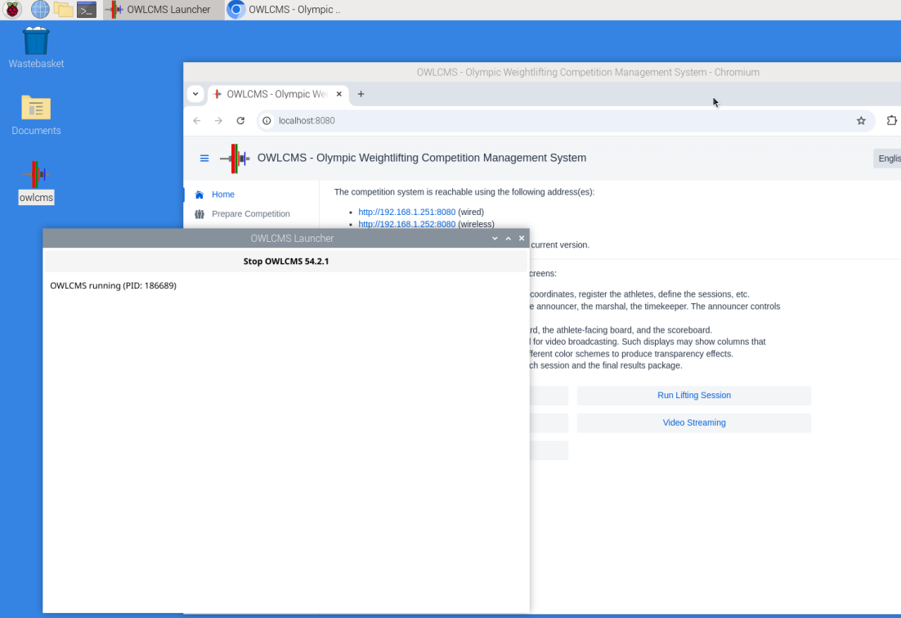

### Updating OWLMCS

When starting the launcher, if you are connected to the Internet, it will try to fetch the available versions.  If you do not have the latest version installed, you will told, and given the option to update.

Updating will copy your existing database as well as changes you may have made to your `local` folder since installing.

> IMPORTANT: As a precaution, if there is important data in your current database, you should always export it before updating. To do so, launch the current version, go to the Prepare Competition page, and use the Export button near the bottom.  Then use the launcher to update.

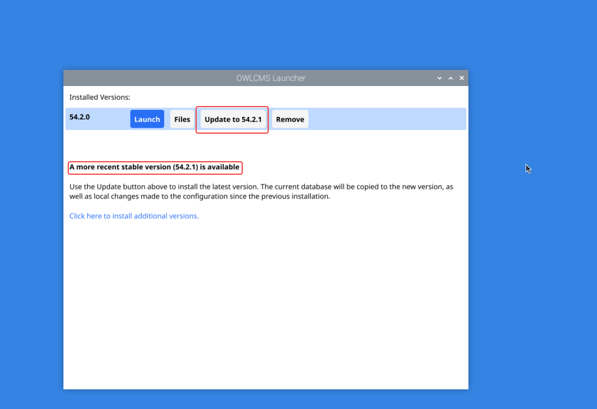